# **KS0397 EASY PLUG Super Starter Kit Arduino tutorial**

# Kit Description

The keyestudio EASY PLUG Super Starter Kit is an entry-level Arduino learning
kit. It has two programming methods, one is Arduino C programming, and the other
is based on blockly MIXLY graphical programming, which is very easy to use and
flexible.

This kit contains everything you need to complete the project. These projects
will teach you how to control and read external sensors and 1602 displays,
control 8\*8 dot matrix, etc.

Although you have little knowledge about electronics, you can use this kit to
realize your ideas if you want.

After using this kit, you will be able to start creating your own projects, and
you can share your own creative works with close family, friends or classmates.

# Kit List

| **No.** | **Component**                                   | **Quantity**  | **Picture**                                      |
|---------|-------------------------------------------------|---------------|--------------------------------------------------|
| 1       | EASY plug Control Board V2.0                    | 1             |   |
| 2       | EASY plug White LED Module                      | 1             |  |
| 3       | EASY plug Blue LED Module                       | 1             |  |
| 4       | EASY plug Red LED Module                        | 1             | 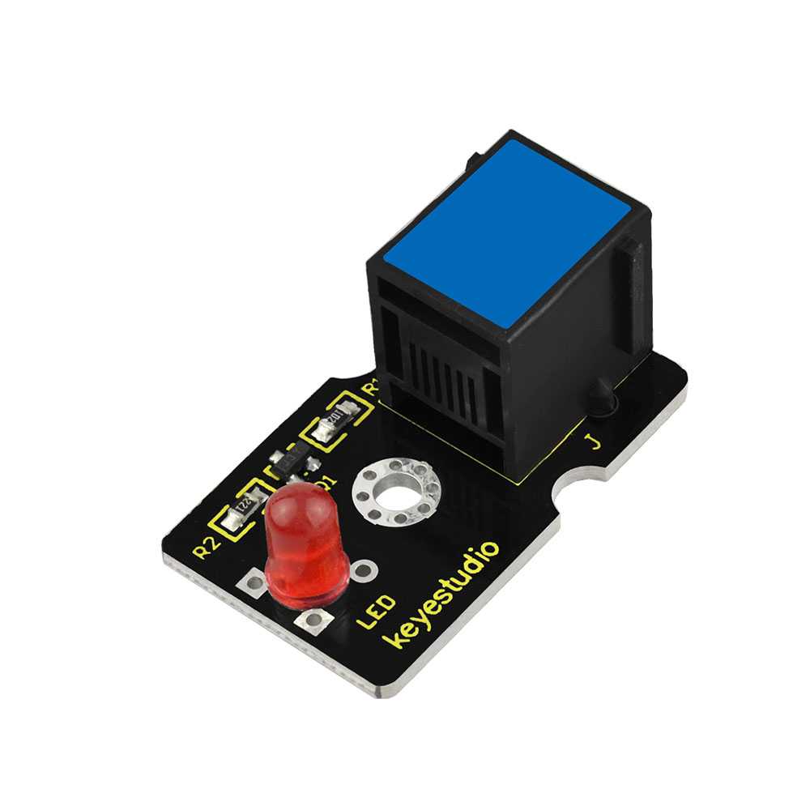 |
| 5       | EASY plug thin-film pressure sensor             | 1             |  |
| 6       | EASY plug Analog Sound Sensor                   | 1             |  |
| 7       | EASY plug Water Level Sensor                    | 1             |  |
| 8       | EASY plug Potentiometer Sensor                  | 1             |  |
| 9       | EASY plug Analog Alcohol Sensor                 | 1             |  |
| 10      | EASY plug LM35 Temperature Sensor               | 1             |  |
| 11      | EASY plug Digital Tilt Sensor Module            | 1             |  |
| 12      | EASY plug Steam Sensor                          | 1             | 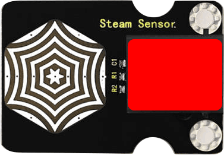  |
| 13      | EASY plug Hall Magnetic Sensor                  | 1             |  |
| 14      | EASY plug Crash Sensor                          | 1             | 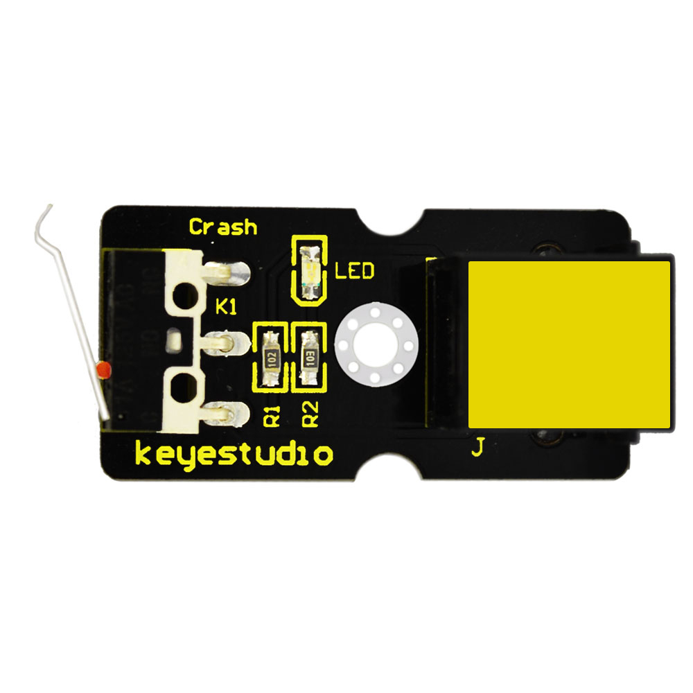 |
| 15      | EASY plug Digital Push Button                   | 1             | 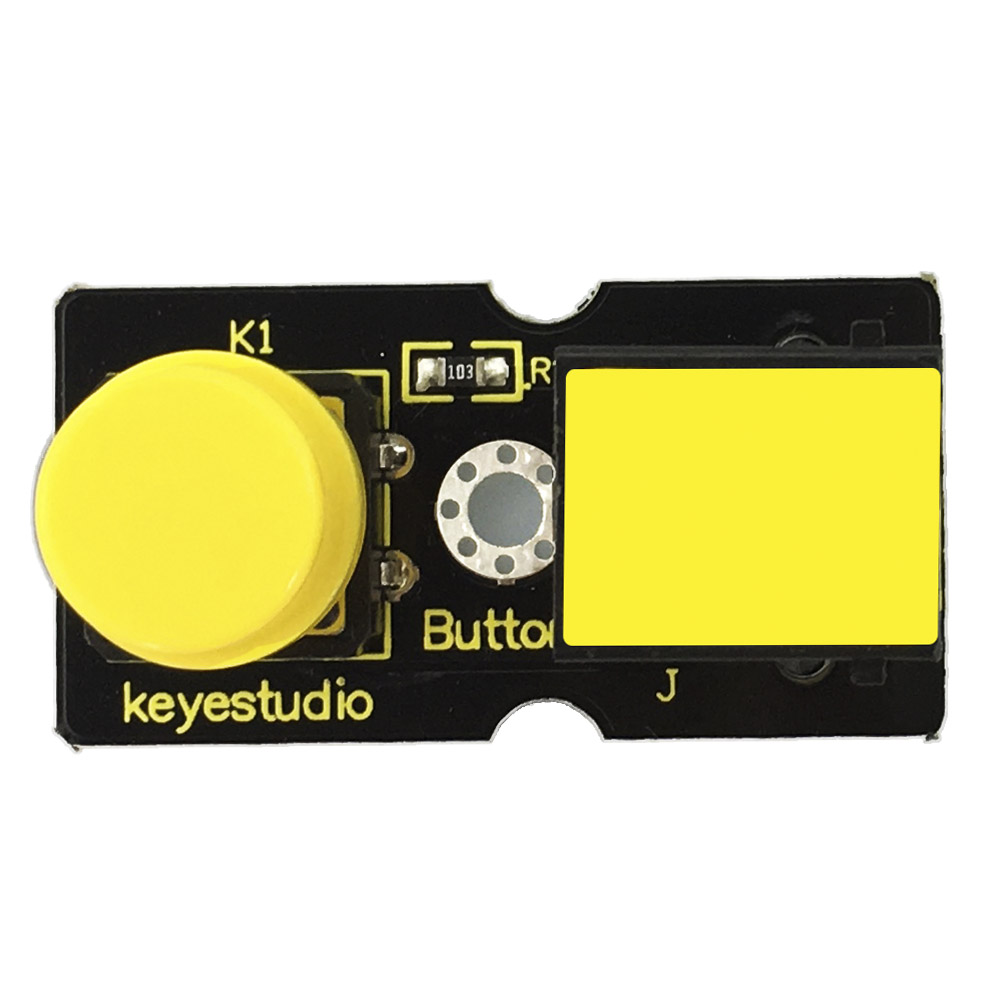 |
| 16      | EASY plug Reed Switch Module                    | 1             |  |
| 17      | EASY plug Line Tracking Sensor                  | 1             |  |
| 18      | EASY plug Photo Interrupter Module              | 1             | 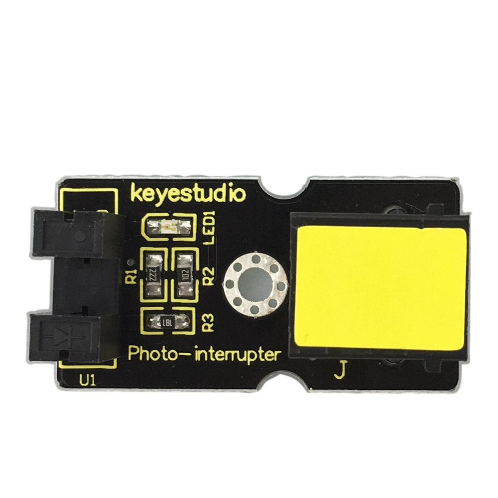 |
| 19      | EASY plug Single Relay Module                   | 1             | 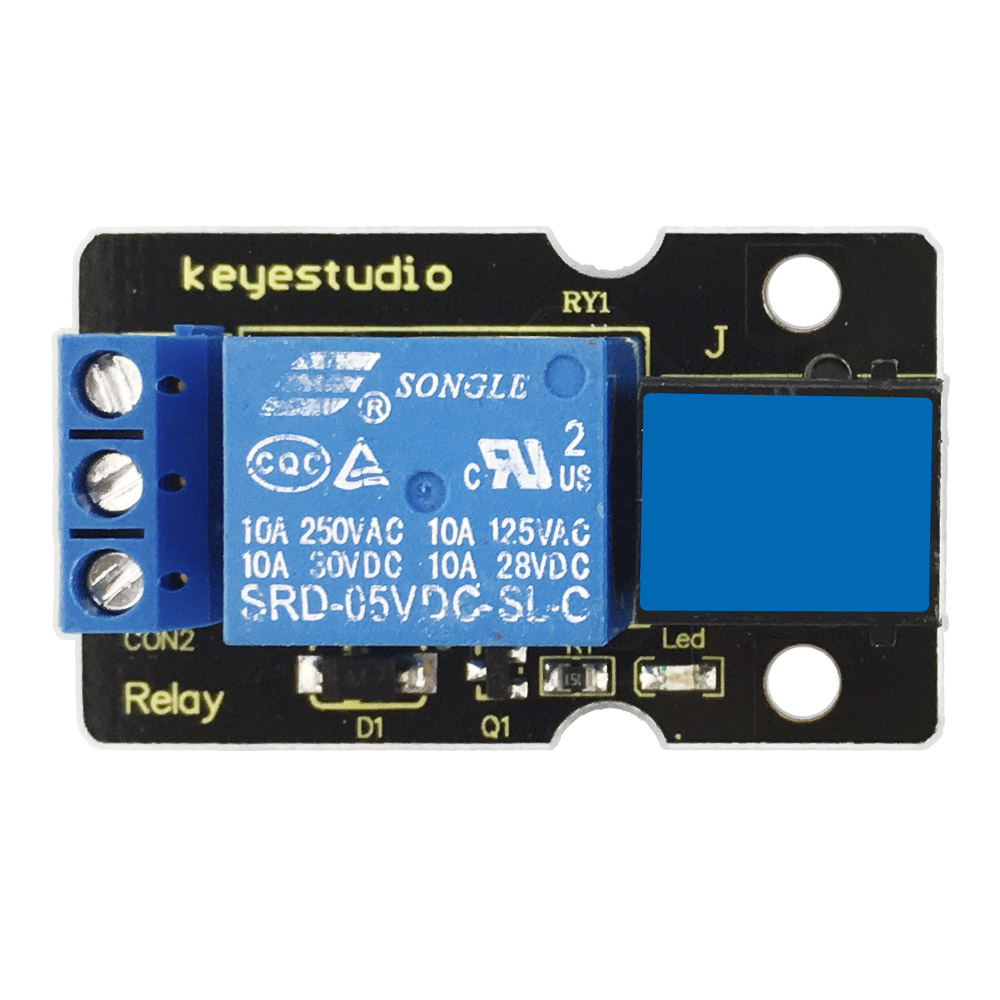 |
| 20      | EASY plug ADXL345 Acceleration Module           | 1             |  |
| 21      | EASY plug DHT11 Temperature and Humidity Sensor | 1             |  |
| 22      | EASY plug 8x8 LED Matrix                        | 1             |  |
| 23      | EASY plug 1602 LCD Module                       | 1             |  |
| 24      | EASY plug 4-digit LED display                   | 1             |  |
| 25      | 200mm blue RJ11 cable                           | 5             |  |
| 26      | 300mm blue RJ11 cable                           | 3             |   |
| 27      | USB cable                                       | 1             |   |
| 28      | Acrylic Boards                                  | 1             |   |
| 29      | Dual-pass M3\*15MM Copper Pillar                | 4             |   |
| 30      | M3\*10MM Round-head Screw                       | 8             |   |

1.  **Keyestudio EASY plug Control Board V2.0**

The processor used in keyestudio EASY plug control board V2.0 is ATmega328.

It has 5 single Digital ports labeled D5 to D9 (of which 3 can be used as PWM
outputs), 1 dual-digital interface (D3-D4), 4 analog inputs (A0-A3), a Joystick
interface (D2-A6-A7), a SPI communication, a serial port communication and an
IIC communication interface. Also with a USB connection, a power jack, two ICSP
headers and a reset button. It breaks out the IO ports with RJ11 6P6C plug.

Simply connect it to a computer with a USB cable or power it via a DC jack to
get started.

For convenience of wire connection, we simplify the pins GND and VCC into each
plug, so you only need one RJ11 6P6C connector wire to connect an external
sensor or module, no need to separately connect the VCC and GND.

So don't worry that the wrong wiring will damage the external products.

Specifications

| **Microcontroller**             | ATmega328P-AU                                        |
|---------------------------------|------------------------------------------------------|
| **Operating Voltage**           | 5V                                                   |
| **Input Voltage (recommended)** | DC7-12V                                              |
| **Single Digital Ports**        | 5 (D5-D9) (of which 3 provide PWM output)            |
| **PWM Digital Ports**           | D5, D6, D9                                           |
| **Analog Input Pins**           | 4 (A0-A3)                                            |
| **DC Current per I/O Pin**      | 20 mA                                                |
| **Flash Memory**                | 32 KB (ATmega328) of which 0.5 KB used by bootloader |
| **SRAM**                        | 2 KB                                                 |
| **EEPROM**                      | 1 KB                                                 |
| **Clock Speed**                 | 16 MHz                                               |

Element and Interfaces:

Here is an explanation of what every element and interface of the board does:

# 4.Detailed Use with ARDUINO Software as follows:

## Step1\| Download the Arduino IDE

When you get the board, first you should install the Arduino software and
driver.

We usually use the Windows software Arduino 1.5.6 version. You can download it
from the link below:

[https://www.arduino.cc/en/Main/OldSoftwareReleases\#1.5.x](https://www.arduino.cc/en/Main/OldSoftwareReleases#1.5.x)

Or you can browse the ARDUINO website to download the latest version from this
link, <https://www.arduino.cc>, pop up the following interface.

Then click the **SOFTWARE** on the browse bar, you will have two options ONLINE
TOOLS and DOWNLOADS.

Click **DOWNLOADS**, it will appear the latest software version of ARDUINO 1.8.5
shown as below.

In this software page, on the right side you can see the version of development
software for different operating systems. ARDUINO has a powerful compatibility.
You should download the software that is compatible with the operating system of
your computer.

We will take **WINDOWS system** as an example here. There are also two options
under Windows system, one is installed version, the other is non-installed
version.

For simple installed version, first click **Windows Installer**, you will get
the following page.

This way you just need to click JUST DOWNLOAD, then click the downloaded file to
install it.

For non-installed version, first click Windows ZIP file, you will also get the
pop-up interface as the above figure.

Click JUST DOWNLOAD, and when the ZIP file is downloaded well to your computer,
you can directly unzip the file and click the icon of ARDUINO software to start
it.

**Installing Arduino (Windows):**

Install Arduino with the exe. Installation package downloaded well.

Click *“I Agree”* to see the following interface.

Click*“Next”*. Pop up the interface below.

You can press Browse… to choose an installation path or directly type in the
directory you want. Then click“Install”to initiate installation.

Wait for the installing process, if appear the interface of Window Security,
just continue to click Install to finish the installation.

**Introduction for Arduino IDE Toolbar:**

Double-click the icon of Arduino software downloaded, you will get the interface
shown below.

(Note: if the Arduino software loads in the wrong language, you can change it in
the preferences dialog. See [the environment
page](http://arduino.cc/en/Guide/Environment#languages) for details.)

The functions of each button on the Toolbar are listed below:

<http://wiki.keyestudio.com/index.php/File:IDE.png>

| ****  **Verify/Compile** | Check the code for errors                           |
|-------------------------------------------------------------------------|-----------------------------------------------------|
| ****  **Upload**         | Upload the current Sketch to the Arduino            |
| **** **New**             | Create a new blank Sketch                           |
| **** **Open**            | Show a list of Sketches                             |
| **** **Save**            | Save the current Sketch                             |
| **** **Serial Monitor**  | Display the serial data being sent from the Arduino |

**Installing the Driver:**

Next, we will introduce the driver installation for the board. The driver
installation may have slight differences in different computer systems. So in
the following let’s move on to the driver installation in the WIN 7 system.

The Arduino folder contains both the Arduino program itself and the drivers that
allow the Arduino to be connected to your computer by a USB cable. Before we
launch the Arduino software, you are going to install the USB drivers.

Plug one end of your USB cable into the Arduino and the other into a USB socket
on your computer.

When you connect the board to your computer at the first time, right click the
icon of your*“Computer” —\>for“Properties”—\> click the“Device manager”*,
under“Other Devices”, you should see an icon for“Unknown device”with a little
yellow warning triangle next to it.

Then right-click on the device and select the top menu option (Update Driver
Software...) shown as the figure below.

It will then be prompted to either “Search Automatically for updated driver
software”or“Browse my computer for driver software”. Shown as below. In this
page, select“Browse my computer for driver software”.

After that, select the option to browse and navigate to the “drivers” folder of
Arduino installation.

Click“Next”and you may get a security warning; if so, allow the software to be
installed. Shown as below.

Installation completed, click“Close”.

Up to now, the driver is installed well. Then you can right click*“Computer”
—\>“Properties”—\>“Device manager”*, you should see the device shown below.

## 

## Step2\| Connect the board

Connect the control board to your computer using the USB cable. The power LED
should go on.

## Step3\| Select the Arduino Board

Open the Arduino IDE, you’ll need to click the“Tools”, then select the Board
that corresponds to your Arduino.

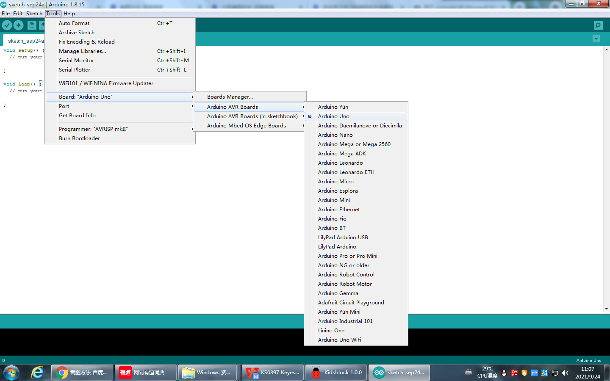

## 

## Step4\| Select your serial port

Select the serial device of the Arduino board from the **Tools \| Serial Port
menu**.

**Note:** to avoid errors, the COM Port should keep the same as the Ports shown
on Device Manager.

## Step5\| Upload the Code

Below is an example code for displaying the Hello World!

Copy and paste the code to the Arduino environment IDE.

**////////////////////////////////////////////////////////////////////////////**

void setup()

{

Serial.begin(9600);

}

void loop()

{

Serial.println("Hello World!");

}

**////////////////////////////////////////////////////////////////////////////**

Then click verify button to check the errors. If compiling successfully, the
message "Done compiling" will appear in the status bar.

After that, click the“Upload”button to upload the code. Wait a few seconds - you
should see the RX and TX leds on the board flashing. If the upload is
successful, the message "Done uploading" will appear in the status bar.

**

**

## Step6\|Open the Serial Monitor

After that, click the monitor button to open the serial monitor.

Then set the baud rate as 9600,
"Hello World!" is showed on the monitor.

**Step 7\|How to Install a Library ?**

Here we will introduce the most simple way to add libraries .

**Step 1：**After downloading well the Arduino IDE, you can right-click the icon
of Arduino IDE.

Find the option "Open file location"

**Step 2:** Click Open file location \>libraries

**Step 3：**Next, find out the“libraries”folder of the starter kit(seen in the
link: https://fs.keyestudio.com/KS0397)

You just need to replicate and paste the following folders into the libraries
folder of Arduino IDE.

Then the libraries of the starter kit are installed successfully, as shown
below:

**5. Started With Your Projects**

## Project 1: LED Blink

**1.Overview**

The LED blinking project is the most basic Arduino project. In this project, we
connect an LED to a digital pin and control it.

1.  **Component Required:**

| EASY plug control board\*1                      | EASY plug LED Module \*1                        | RJ11 cable\*1                                    | USB cable\*1                                    |
|-------------------------------------------------|-------------------------------------------------|--------------------------------------------------|-------------------------------------------------|
|  |  |   |  |

**3.Component Introduction:**

The LED light modules have shiny colors, ideal for Arduino starters. It can be
easily connected to IO/Sensor shield.

Note: this module needs to be used together with EASY plug control board. You
can also choose other LED to emit different color of light like blue, green,
yellow and red.

-   Sensor type: Digital

-   Interface: Easy plug

-   PH2.54 socket

**4.Connect It Up**

Connect the EASY Plug LED module to control board using an RJ11 cable.

**5.Upload the Code**

/\*

keyestudio Easy plug super kit

Project 1

Blink

http://www.keyestudio.com

\*/

// the setup function runs once when you press reset or power the board

void setup() {

// initialize digital pin 9 as an output.

pinMode(9, OUTPUT);

}

// the loop function runs over and over again forever

void loop() {

digitalWrite(9, HIGH); // turn the LED on (HIGH is the voltage level)

delay(1000); // wait for a second

digitalWrite(9, LOW); // turn the LED off by making the voltage LOW

delay(1000); // wait for a second

}

//\*\*\*\*\*\*\*\*\*\*\*\*\*\*\*\*\*\*\*\*\*\*\*\*\*\*\*\*\*\*\*\*\*\*\*\*\*\*\*\*\*\*\*\*\*\*\*\*\*\*\*\*\*\*\*\*\*

**6.What You Should See**

The LED will flash on for one second, then blink off for one second.

If it doesn’t, make sure you have assembled the circuit correctly and verified
and uploaded the code to your board.

**Project 2: PWM**

**1.Overview**

LED blinking can be achieved through high and low levels, so how to control the
brightness of the LED? PWM technology is used to control the brightness of LEDs.

PWM, short for Pulse Width Modulation, is a technique used to encode analog
signal level into digital ones.

A computer cannot output analog voltage but only digital voltage values such as
0V or 5V. So we use a high resolution counter to encode a specific analog signal
level by modulating the duty cycle of PMW.

The PWM signal is also digitalized because in any given moment, fully on DC
power supply is either 5V (ON), or 0V (OFF). The voltage or current is fed to
the analog load (the device that uses the power) by repeated pulse sequence
being ON or OFF. Being on, the current is fed to the load; being off, it's not.

With adequate bandwidth, any analog value can be encoded using PWM. The output
voltage value is calculated via the on and off time.

Output voltage = (turn on time/pulse time) \* maximum voltage value

PWM has many applications: lamp brightness regulating, motor speed regulating,
sound making, etc.

**The following are the three basic parameters of PMW:**

1\. The amplitude of pulse width (minimum / maximum)

2\. The pulse period (The reciprocal of pulse frequency in 1 second)

3\. The voltage level (such as 0V-5V )

There are 6 PMW pins on Arduino board, namely digital pin 3, 5, 6, 9, 10, and
11.

**2.Component Required:**

| EASY plug control board\*1                      | EASY plug LED Module \*1                        | RJ11 cable\*1                                    | USB cable\*1                                    |
|-------------------------------------------------|-------------------------------------------------|--------------------------------------------------|-------------------------------------------------|
|  |  |   |  |

-   EASY plug control board\*1

-   EASY plug LED Module \*1

-   RJ11 cable\*1

-   USB cable\*1

**3.Connect It Up**

**4.Test Code**

/\*

keyestudio Easy plug super kit

Project 2

PWM

http://www.keyestudio.com

\*/

int led = 9; // the PWM pin the LED is attached to

int brightness = 0; // how bright the LED is

int fadeAmount = 5; // how many points to fade the LED by

// the setup routine runs once when you press reset:

void setup() {

// declare pin 9 to be an output:

pinMode(led, OUTPUT);

}

// the loop routine runs over and over again forever:

void loop() {

// set the brightness of pin 9:

analogWrite(led, brightness);

// change the brightness for next time through the loop:

brightness = brightness + fadeAmount;

// reverse the direction of the fading at the ends of the fade:

if (brightness \<= 0 \|\| brightness \>= 255) {

fadeAmount = -fadeAmount;

}

// wait for 30 milliseconds to see the dimming effect

delay(30);

}

//\*\*\*\*\*\*\*\*\*\*\*\*\*\*\*\*\*\*\*\*\*\*\*\*\*\*\*\*\*\*\*\*\*\*\*\*\*\*\*\*\*\*\*\*\*\*\*\*\*\*\*\*\*\*\*\*\*\*\*\*\*\*

**5.What You Should See**

The LED gradually becomes brighter and gradually dimming.

If it doesn’t, make sure you have assembled the circuit correctly and verified
and uploaded the code to your board.

**  
Project 3：SOS light**

**1.Overview**

SOS is a Morse code distress signal, used internationally, that was originally
established for maritime use. In formal notation SOS is written with an
overscore line, to indicate that the Morse code equivalents for the individual
letters of "SOS" are transmitted as an unbroken sequence of three dots / three
dashes / three dots, with no spaces between the letters.[1] In International
Morse Code three dots form the letter "S" and three dashes make the letter "O",
so "S O S" became a common way to remember the order of the dots and dashes.
(IWB, VZE, 3B, and V7 form equivalent sequences, but traditionally SOS is the
easiest to remember.)

**2.Component Required:**

| EASY plug control board\*1                      | EASY plug LED Module \*1                        | RJ11 cable\*1                                    | USB cable\*1                                    |
|-------------------------------------------------|-------------------------------------------------|--------------------------------------------------|-------------------------------------------------|
|  |  |   |  |

-   EASY plug control board\*1

-   EASY plug LED Module \*1

-   RJ11 cable\*1

-   USB cable\*1

**3.Connect It Up**

**4.Test Code**

/\*

keyestudio Easy plug super kit

Project 3

s o s

http://www.keyestudio.com

\*/

int ledPin = 9;

void setup() {

pinMode(ledPin, OUTPUT);

}

void loop() {

// stand for“S”with three quick flash

for(int x=0;x\<3;x++){

digitalWrite(ledPin,HIGH); //set LED on

delay(150); //delay in 150ms

digitalWrite(ledPin,LOW); //set LED off

delay(100); //delay in 100ms

}//

delay(100);

// stand for“O”with three short flash

for(int x=0;x\<3;x++){

digitalWrite(ledPin,HIGH); //set LED on

delay(400); //delay in 400ms

digitalWrite(ledPin,LOW); //set LED off

delay(100); //delay in 100ms

}//

delay(100);// stand for“S”with three quick flash

for(int x=0;x\<3;x++){

digitalWrite(ledPin,HIGH); //set LED on

delay(150); //delay in 150ms

digitalWrite(ledPin,LOW); //set LED off

delay(100); //delay in 100ms

}// wait for 5s before repeating S.0.S

delay(5000);

}

//\*\*\*\*\*\*\*\*\*\*\*\*\*\*\*\*\*\*\*\*\*\*\*\*\*\*\*\*\*\*\*\*\*\*\*\*\*\*\*\*\*\*\*\*\*\*\*\*\*\*\*\*\*\*\*\*

**5.What You Should See**

Upload code to Arduino, LED will show S.O.S signal, wait for 5s and show it
again.

Plug external power in Arduino, and place them in a waterproof box, then S.O.S
signal can be sent.

S.O.S signal is usually applied in maritime use and mountain-climbing.

**Project 4：LED Chasing Effect**

**1.Overview**

Flow light is commonly viewed in our daily life, such as on building,
advertisement board and so on. We will show you how to make a flow light in this
part.

**2.Component Required:**

| EASY plug control board\*1                      | EASY plug LED Module \*3                                                                                                                      | RJ11 cable\*3                                                                                                                                  | USB cable\*1                                    |
|-------------------------------------------------|-----------------------------------------------------------------------------------------------------------------------------------------------|------------------------------------------------------------------------------------------------------------------------------------------------|-------------------------------------------------|
|  |  |   |  |

**3.Connect It Up**

**4. Test Code**

/\*

keyestudio Easy plug super kit

Project 4

LED Chasing Effect

http://www.keyestudio.com

\*/

int whiteled=7;

int redled=8;

int blueled=9;

void setup()

{

pinMode(whiteled,OUTPUT);

pinMode(redled,OUTPUT);

pinMode(blueled,OUTPUT);

}

void loop()

{

digitalWrite(whiteled,HIGH);//turn on the white led

delay(100);//delay in 0.1s

digitalWrite(whiteled,LOW);//turn off the white led

delay(100);//delay in 1s

digitalWrite(redled,HIGH);//turn on the red led

delay(100);//delay in 0.1s

digitalWrite(redled,LOW);//turn off the red led

delay(100);//delay in 0.1s

digitalWrite(blueled,HIGH);//turn on the blue led

delay(100);//delay in 0.1s

digitalWrite(blueled,LOW);//turn off the blue led

delay(100);//delay in 0.1s

}

//\*\*\*\*\*\*\*\*\*\*\*\*\*\*\*\*\*\*\*\*\*\*\*\*\*\*\*\*\*\*\*\*\*\*\*\*\*\*\*\*\*\*\*\*

**5. What You Should See**

After downloading code, we will view white, red and blue LEDs flash ceaselessly.

## Project 5: Relay

**1.Overview**

In this project, we will show you how to control a relay module. This relay
module uses a high-quality relay. A relay is basically an electrically
controlled mechanical switch. It can be used to interactive projects.

1.  **Component Required:**

| EASY plug control board\*1                      | EASY plug Relay Module \*1                      | RJ11 cable\*1                                    | USB cable\*1                                    |
|-------------------------------------------------|-------------------------------------------------|--------------------------------------------------|-------------------------------------------------|
|  |  |   |  |

**3.Component Introduction:**

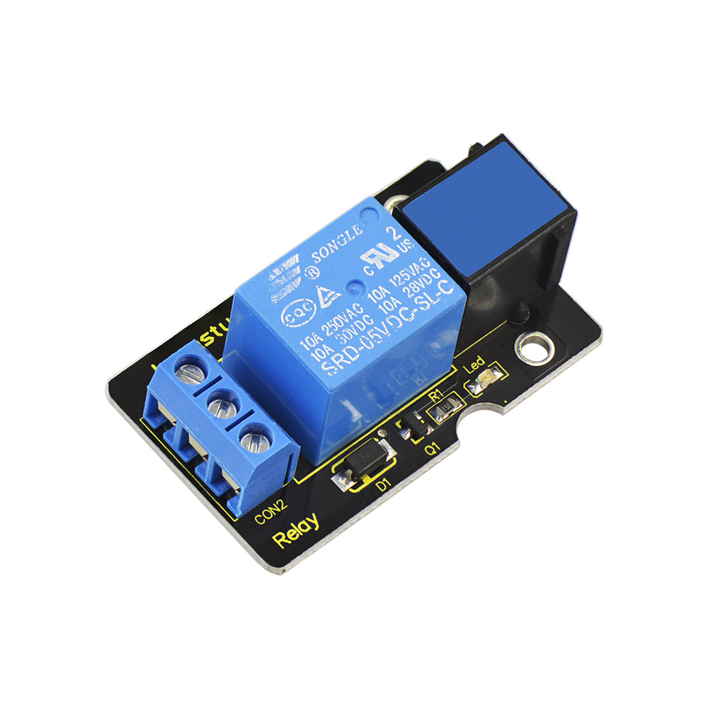**EASY plug Single Relay
Module**

This EASY Plug relay module uses a high-quality relay. A relay is basically an
electrically controlled mechanical switch.

It is one of the most important controlled elements, which is widely used to
control the lighting, communications, remote sensing, electrical and other
equipments.

The Relay output state by a light-emitting diode, observing the relay ON and OFF
status.

It can be controlled through the digital IO port, such as lamps, motors and
other high current or high voltage devices.

-   Type: Digital

-   Rated current: 10A (NO) 5A (NC)

-   Maximum switching voltage: 150VAC 24VDC

-   Digital interface

-   Control signal: TTL level

-   Rated load: 8A 150VAC (NO) 10A 24VDC (NO); 5A 250VAC (NO/NC) 5A 24VDC
    (NO/NC)

-   Maximum switching power: AC1200VA DC240W (NO); AC625VA DC120W (NC)

-   Contact action time: 10ms

**4.Connect It Up**

Connect the EASY Plug Single Relay module to control board using an RJ11 cable.

**5.Upload the Code**

//Below is an example code.

/\*

keyestudio Easy plug super kit

Project 5

Relay

http://www.keyestudio.com

\*/

// the setup function runs once when you press reset or power the board

void setup() {

// initialize digital pin 8 as an output.

pinMode(8, OUTPUT);

}

// the loop function runs over and over again forever

void loop() {

digitalWrite(8, HIGH); // turn the relay on (HIGH is the voltage level)

delay(1000); // wait for a second

digitalWrite(8, LOW); // turn the relay off by making the voltage LOW

delay(1000); // wait for a second

}

//\*\*\*\*\*\*\*\*\*\*\*\*\*\*\*\*\*\*\*\*\*\*\*\*\*\*\*\*\*\*\*\*\*\*\*\*\*\*\*\*\*\*\*\*\*\*\*\*\*\*\*\*\*\*\*\*\*

**6.What You Should See**

Done uploading the code, you should be able to hear the relay contacts click.
When the relay is off, the COM (common) terminal block will be connected to the
NC (Normally Closed) terminal block.

When the relay is on, the COM (common) terminal block will be connected to the
NO (Normally Open) terminal block.

## 

## Project 6: Button

**1.Overview**

In this project, we’ll be looking at the one of the most common and simple
inputs- a push button. It is an elegant way to control power to your project.
Press once to turn on, then press again to turn off. Press to release pleasure!

**2. Component Required:**

| EASY plug control board\*1                      | EASY plug LED Module \*1                        | EASY plug Digital Push Button \*1               | RJ11 cable\*2                                                                                  | USB cable\*1                                    |
|-------------------------------------------------|-------------------------------------------------|-------------------------------------------------|------------------------------------------------------------------------------------------------|-------------------------------------------------|
|  |  |  |  |  |

**3.Component Introduction:**

******EASY
plug Push Button Module**

The EASY Plug Push-button module is a tidy little design that lets you control a
DC power source using an everyday tactile button.

This basic application module is widely applied to Arduino, Raspberry Pi
platforms.

When the button is pressed, it outputs HIGH level signal; if release the button,
it outputs LOW level signal.

You can simply connect to an IO port to have your first taste of Arduino.

-   Supply Voltage: 3.3V to 5V

-   Large button and high-quality top cap

-   Sensor type: Digital

**4.Connect It Up**

Connect the EASY Plug push button sensor and LED module to control board using
RJ11 cables.

**5.Upload the Code**

/\*

keyestudio Easy plug super kit

Project 6

Button

http://www.keyestudio.com

\*/

int ledPin = 9; // choose the pin for the LED

int inputPin = 5; // Connect Button to input pin D5

void setup() {

pinMode(ledPin, OUTPUT); // declare LED as output

pinMode(inputPin, INPUT); // declare button as input

}

void loop(){

int val = digitalRead(inputPin); // read Button input value

if (val == HIGH) { // check if the input is HIGH

digitalWrite(ledPin, LOW); // turn LED OFF

} else {

digitalWrite(ledPin, HIGH); // turn LED ON

}

}

//\*\*\*\*\*\*\*\*\*\*\*\*\*\*\*\*\*\*\*\*\*\*\*\*\*\*\*\*\*\*\*\*\*\*\*\*\*\*\*\*\*\*\*\*\*\*\*\*\*\*\*\*\*\*\*\*\*\*\*

**6.What You Should See**

Powered up and upload well the code, press down the button, LED module is turned
on. While release the button, LED is off.

## Project 7: Line Tracking

**1.Overview**

If you want to build a line tracking robot, the easiest way is to use a line
tracking sensor. Line following is the most basic function of smart mobile
robot.

We designed this new generation of line tracking sensor to be your robot's
powerful copilot all the way. It will guide your robot by telling white from
black quickly and accurately, via TTL signal.

1.  **Component Required:**

| EASY plug control board\*1                      | EASY plug LED Module \*1                        | EASY plug Line Tracking Sensor \*1               | RJ11 cable\*2                                                                                   | USB cable\*1                                    |
|-------------------------------------------------|-------------------------------------------------|--------------------------------------------------|-------------------------------------------------------------------------------------------------|-------------------------------------------------|
|  |  |   |   |  |

**3.Component Introduction:**

**EASY plug Line Tracking
Sensor**

The Line Tracking Sensor can tell white from in black or black from white
accurately.

The single line-tracking signal provides a stable output signal TTL for a more
accurate and more stable line.

The working principle is simple, using infrared light's different reflectivity
for different color, and converting the strength of the reflected signal into
current signal.

-   Power supply: 5V

-   Operating current: \<10mA

-   Operating temperature: 0℃\~ 50℃

-   Output Level: TTL (Black for LOW output, White for HIGH output)

-   High quality connector

**4.Connect It Up**

Connect the EASY Plug line tracking sensor and LED module to control board using
RJ11 cables.

**5.Upload the Code**

/\*

keyestudio Easy plug super kit

Project 7

line tracking

http://www.keyestudio.com

\*/

int ledPin = 9; // choose the pin for the LED

int inputPin = 5; // Connect line tracking sensor to input pin D5

void setup() {

pinMode(ledPin, OUTPUT); // declare LED as output

pinMode(inputPin, INPUT); // declare line tracking sensor as input

}

void loop(){

int val = digitalRead(inputPin); // read line tracking sensor input value

if (val == HIGH) { // check if the input is HIGH

digitalWrite(ledPin, LOW); // turn LED OFF

} else {

digitalWrite(ledPin, HIGH); // turn LED ON

}

}

//\*\*\*\*\*\*\*\*\*\*\*\*\*\*\*\*\*\*\*\*\*\*\*\*\*\*\*\*\*\*\*\*\*\*\*\*\*\*\*\*\*\*\*\*\*\*\*\*\*\*\*\*\*\*\*\*\*\*\*

**6.What You Should See**

Upload the test code, when the line tracking sensor detects the white object,
its indicator will be on; if no object is detected, its indicator will be off.

## Project 8: Crash

**1.Overview**

We use a crash sensor to detect whether happen collision or not. When an object
crashes the metal switch of the sensor, it will output LOW level signal. When
the switch is disconnected, it will keep HIGH level.

**2. Component Required:**

| EASY plug control board\*1                      | EASY plug LED Module \*1                        | EASY plug Crash sensor \*1                      | RJ11 cable\*2                                                                                   | USB cable\*1                                    |
|-------------------------------------------------|-------------------------------------------------|-------------------------------------------------|-------------------------------------------------------------------------------------------------|-------------------------------------------------|
|  |  |  |   |  |

**3.Component Introduction:**

**EASY Plug Crash Sensor**

Crash sensor, also known as snap-action switch, is an electric switch that is
actuated by very little physical force.

It is a digital on-off input module necessary for elementary electronic.

By programming, it can be used for the light, sound device, key function of LCD
display, 3D Printer position feedback, or other devices.

-   Onboard status indicator LED

-   M3 mounting hole, convenient for fixation on other devices.

-   If collision happened, outputs LOW level signal; no collision, outputs HIGH
    level signal.

**4.Connect It Up**

Connect the EASY Plug Crash sensor to control board using an RJ11 cable.

**5.Upload the Code**

/\*

keyestudio Easy plug super kit

Project 8

Crash Sensor

http://www.keyestudio.com

\*/

int ledPin = 9; // choose the pin for the LED

int inputPin = 5; // Connect Crash Sensor to input pin D5

void setup() {

pinMode(ledPin, OUTPUT); // declare LED as output

pinMode(inputPin, INPUT); // declare Crash Sensor as input

}

void loop(){

int val = digitalRead(inputPin); // read Crash Sensor input value

if (val == HIGH) { // check if the input is HIGH

digitalWrite(ledPin, LOW); // turn LED OFF

} else {

digitalWrite(ledPin, HIGH); // turn LED ON

}

}

//\*\*\*\*\*\*\*\*\*\*\*\*\*\*\*\*\*\*\*\*\*\*\*\*\*\*\*\*\*\*\*\*\*\*\*\*\*\*\*\*\*\*\*\*\*\*\*\*\*\*\*\*\*\*\*\*\*\*\*

**6.What You Should See**

When an object knocks the metal switch of the sensor, the LED will be turned
off. If no crash happened, LED will be turned on.

## Project 9: Magnetic Field

**1.Overview**

This project will tell you how to detect whether there is a magnetic field
nearby or not ? Use a reed switch module.

1.  **Component Required:**

| EASY plug control board\*1                      | EASY plug LED Module \*1                        | EASY plug Reed Switch Module \*1                | RJ11 cable\*2                                                                                  | USB cable\*1                                    |
|-------------------------------------------------|-------------------------------------------------|-------------------------------------------------|------------------------------------------------------------------------------------------------|-------------------------------------------------|
|  |  |  |  |  |

**3.Component Introduction:**

**EASY plug Reed Switch Module**

This is a small device called a [reed
switch](http://en.wikipedia.org/wiki/Reed_switch) on the module.

When the device is exposed to a magnetic field, the two ferrous materials inside
the switch pull together and the switch closes.

When the magnetic field is removed, the reeds separate and the switch opens.
This makes for a great non-contact switch.

You can mount reed switch on the door for alarming purpose or as switches.

-   Interface: Easy plug

-   Working voltage: DC 3.3V-5V

-   Working current: ≥20mA

-   Working temperature: －10℃ to＋50℃

-   Detection distance: ≤10mm

**4.Connect It Up**

Connect the EASY Plug Reed switch module and LED module to control board using
RJ11 cables.

**5. Upload the Code**

/\*

keyestudio Easy plug super kit

Project 9

Reed Switch Module

http://www.keyestudio.com

\*/

int ledPin = 9; // choose the pin for the LED

int inputPin = 5; // Connect Reed Switch Module to input pin D5

void setup() {

pinMode(ledPin, OUTPUT); // declare LED as output

pinMode(inputPin, INPUT); // declare Reed Switch Module as input

}

void loop(){

int val = digitalRead(inputPin); // read Reed Switch Module input value

if (val == HIGH) { // check if the input is HIGH

digitalWrite(ledPin, LOW); // turn LED OFF

} else {

digitalWrite(ledPin, HIGH); // turn LED ON

}

}

//\*\*\*\*\*\*\*\*\*\*\*\*\*\*\*\*\*\*\*\*\*\*\*\*\*\*\*\*\*\*\*\*\*\*\*\*\*\*\*\*\*\*\*\*\*\*\*\*\*\*\*\*\*\*\*\*\*\*\*

**6.What You Should See**

If you put a magnetic bead close to the reed module, once the reed module
detects the magnetic field, LED will turn on.

## Project 10: Photo Interrupter

**1.Overview**

In this project, you will learn about how to use a photo interrupter module to
turn on the LED and print the analog value on the monitor.

**2. Component Required:**

| EASY plug control board\*1                      | EASY plug LED Module \*1                        | EASY plug Photo Interrupter Module \*1           | RJ11 cable\*2                                                                                  | USB cable\*1                                    |
|-------------------------------------------------|-------------------------------------------------|--------------------------------------------------|------------------------------------------------------------------------------------------------|-------------------------------------------------|
|  |  |   |  |  |

**3.Component Introduction:**

**EASY plug Photo Interrupter
Module**

This is a high performance EASY Plug photo interrupter module.

It integrates a photo-interrupter, which belongs to an optical switch of a
photo-interrupting photoelectric switch.

The upright part on the module combines an infrared light emitting diode and
shielded infrared detector.

By emitting a beam of infrared light from one end to another end, the sensor can
detect an object when it passes through the beam.

Useful for many applications such as optical limit switches, pellet dispensing,
general object detection, etc.

Note: this module needs to be used together with EASY plug control board.

-   Supply Voltage: 3.3V to 5V

-   Interface: Digital

**4.Connect It Up**

Connect the EASY Plug Photo Interrupter module and LED module to control board
using RJ11 cables.

**5. Upload the Code**

/\*

keyestudio Easy plug super kit

Project 10

Photo Interrupter Module

http://www.keyestudio.com

\*/

int ledPin = 9; // choose the pin for the LED

int inputPin = 5; // Connect Photo Interrupter Module to input pin D5

void setup() {

pinMode(ledPin, OUTPUT); // declare LED as output

pinMode(inputPin, INPUT); // declare Photo Interrupter Module as input

}

void loop(){

int val = digitalRead(inputPin); // read Photo Interrupter Module input value

if (val == HIGH) { // check if the input is HIGH

digitalWrite(ledPin, LOW); // turn LED OFF

} else {

digitalWrite(ledPin, HIGH); // turn LED ON

}

}

//\*\*\*\*\*\*\*\*\*\*\*\*\*\*\*\*\*\*\*\*\*\*\*\*\*\*\*\*\*\*\*\*\*\*\*\*\*\*\*\*\*\*\*\*\*\*\*\*\*\*\*\*\*\*\*\*\*\*\*

**6.What You Should See**

Upload the code and power on. If you place a piece of paper in the groove of the
module, LED will be turned off. If the paper is removed, the LED will be on

## Project 11: Hall Magnetic Detection

**1.Overview**

What's the best way to detect the magnet? Use another magnet. But it's not
sensitive enough. You have to feel it by yourself.

Here you can try to use a hall sensor. It has the characteristics of high
sensitivity, fast response, good temperature performance and high reliability.

1.  **Component Required:**

| EASY plug control board\*1                      | EASY plug LED Module \*1                        | EASY plug Hall Magnetic Sensor\*1               | RJ11 cable\*2                                                                                  | USB cable\*1                                    |
|-------------------------------------------------|-------------------------------------------------|-------------------------------------------------|------------------------------------------------------------------------------------------------|-------------------------------------------------|
|  |  |  |  |  |

**3.Component Introduction:**

**EASY plug Hall Magnetic
Sensor**

The Hall sensor is based on Hall Effect.

It can detect whether there is a magnetic object nearby or not. And it correctly
tells you through digital output.

This sensor uses the SFE Reed Switch - Magnetic Field Sensor. It can sense the
magnetic materials within a detection range up to 75px.

The detection range and the strength of magnetic field are proportional.

It is useful for non-contact/waterproof type switches, position sensors,
rotary/shaft encoders.

-   Sensing magnetic materials

-   Detection range: up to 75px

-   Output: Digital ON/OFF

-   Detection range and magnetic field strength are proportional

**4.Connect It Up**

Connect the EASY Plug Hall Magnetic Sensor and LED module to control board using
RJ11 cables.

**5. Upload the Code**

/\*

keyestudio Easy plug super kit

Project 11

Hall Magnetic Sensor

http://www.keyestudio.com

\*/

int ledPin = 9; // choose the pin for the LED

int inputPin = 5; // Connect Hall Magnetic Sensor to input pin D5

void setup() {

pinMode(ledPin, OUTPUT); // declare LED as output

pinMode(inputPin, INPUT); // declare Hall Magnetic Sensor as input

}

void loop(){

int val = digitalRead(inputPin); // read Hall Magnetic Sensor input value

if (val == HIGH) { // check if the input is HIGH

digitalWrite(ledPin, LOW); // turn LED OFF

} else {

digitalWrite(ledPin, HIGH); // turn LED ON

}

}

//\*\*\*\*\*\*\*\*\*\*\*\*\*\*\*\*\*\*\*\*\*\*\*\*\*\*\*\*\*\*\*\*\*\*\*\*\*\*\*\*\*\*\*\*\*\*\*\*\*\*\*\*\*\*\*\*\*\*\*

**6.What You Should See**

When magnetic beads are approaching to the sensor, the LED will be turned on.
Otherwise, the LED is off.

## Project 12: Tilt Switch

**1.Overview**

This lesson we are going to test the tilt sensor. Simply connect to EASY Plug
control board to make amazing interactive projects.

**2. Component Required:**

| EASY plug control board\*1                      | EASY plug LED Module \*1                        | EASY plug Tilt Sensor \*1                       | RJ11 cable\*2                                                                                  | USB cable\*1                                    |
|-------------------------------------------------|-------------------------------------------------|-------------------------------------------------|------------------------------------------------------------------------------------------------|-------------------------------------------------|
|  |  | 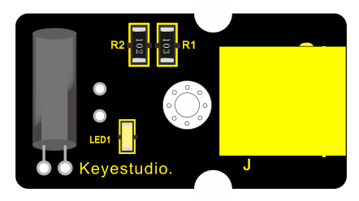 |  |  |

**3.Component Introduction:**

**EASY plug Tilt Sensor Module**

The tilt-switch twig is the equivalent of a button, and is used as a digital
input. Inside the tilt switch is a ball that make contact with the pins when the
case is upright. Tilt the case over and the balls don't touch, thus not making a
connection. When the switch is level it is open, and when tilted, the switch
closes.

It can be used for orientation detection, alarm device or others.

Here is the principle of tilt sensor to illustrate how it works:

-   Interface: Easy plug

-   Supply Voltage: 3.3V to 5V

-   Sensor type: Digital

**4.Connect It Up**

Connect the EASY Plug Tilt sensor and LED module to control board using RJ11
cables.

**5. Upload the Code**

/\*

keyestudio Easy plug super kit

Project 12

Tilt Sensor

http://www.keyestudio.com

\*/

int ledPin = 9; // choose the pin for the LED

int inputPin = 5; // Connect Tilt Sensor to input pin D5

void setup()

{

pinMode(ledPin,OUTPUT); // declare LED as output

pinMode(inputPin,INPUT); // declare Tilt Sensor as input

}

void loop() {

int val = digitalRead(inputPin); // read Tilt Sensor input value

if (val == HIGH)

{ // check if the input is HIGH

digitalWrite(ledPin, LOW); // turn LED OFF

}

else {

digitalWrite(ledPin, HIGH); // turn LED ON

}

}

//\*\*\*\*\*\*\*\*\*\*\*\*\*\*\*\*\*\*\*\*\*\*\*\*\*\*\*\*\*\*\*\*\*\*\*\*\*\*\*\*\*\*\*\*\*\*\*\*\*\*\*\*\*\*\*\*\*\*\*

**6.What You Should See**

Done uploading the code, if tilt the sensor, you should see the led state ON or
OFF.

**

## Project 13: Analog Temperature

**1.Overview**

In this circuit, you will learn how to integrate the temperature sensor with
your EASY Plug control board, and display the analog temperature on the serial
monitor.

1.  **Component Required:**

| EASY plug control board\*1                      | EASY plug LM35 Temperature Sensor \*1           | RJ11 cable\*1                                    | USB cable\*1                                    |
|-------------------------------------------------|-------------------------------------------------|--------------------------------------------------|-------------------------------------------------|
|  |  |   |  |

**3.Component Introduction:**

**EASY plug LM35 Temperature
Sensor**

It is based on semiconductor LM35 temperature sensor. A temperature sensor is
exactly what it sounds like - a sensor used to measure ambient temperature.

It is effective in the range between 0 degree Celsius and 100 degree Celsius.
Sensitivity is 10mV per degree Celsius. The output voltage is proportional to
the temperature.

-   Power supply: 5V

-   Sensitivity: 10mV per degree Celsius

-   Function range: 0℃ to 100℃

**4.Connect It Up**

Connect the EASY Plug LM35 temperature to control board using an RJ11 cable.

**5.Upload the Code**

/\*

keyestudio Easy plug super kit

Project 13

Temperature

http://www.keyestudio.com

\*/

\#define sensorPin A0

void setup() {

// Begin serial communication at a baud rate of 9600:

Serial.begin(9600);

// Set the reference voltage for analog input to the built-in 1.1 V reference:

analogReference(INTERNAL);

}

void loop() {

// Get a reading from the temperature sensor:

int reading = analogRead(sensorPin);

// Convert the reading into voltage:

float voltage = reading \* (1100 / 1024.0);

// Convert the voltage into the temperature in degree Celsius:

float temperature = voltage / 10;

// Print the temperature in the Serial Monitor:

Serial.print(temperature);

Serial.print(" \\xC2\\xB0"); // shows degree symbol

Serial.println("C");

delay(1000); // wait a second between readings

}

**6.What You Should See**

Done uploading the code, open the serial monitor and set the baud rate to 9600,
you should see the analog temperature value.

## Project 14: Sound

**1.Overview**

When we walk through the corridor to make a sound, the corridor light will
automatically light up, after that, quiet down, the lights are off. Why?
Actually inside the lighting circuit, it has installed a sound sensor. When
detects the sound, light is turned on, or else LED off.

In this lesson, we will connect a sound sensor to EASY Plug control board,
detecting the outside sound and printing out the analog value.

1.  **Component Required:**

| EASY plug control board\*1                      | EASY plug Analog Sound Sensor \*1               | RJ11 cable\*1                                    | USB cable\*1                                    |
|-------------------------------------------------|-------------------------------------------------|--------------------------------------------------|-------------------------------------------------|
|  |  |   |  |

**3.Component Introduction:**

**EASY plug Analog Sound Sensor**

It is typically used in detecting the loudness in ambient environment. You can
use it to make interactive circuits such as a voice-operated switch.

The sound sensitivity can be adjusted by the potentiometer.

The sensor comes with a fixed hole, easy for fixation on other devices.

-   Sensor type: Analog

-   Supply Voltage: 3.3V to 5V

-   Operating current：\<10mA

-   Output signal：analog signal

**4.Connect It Up**

Connect the EASY Plug sound sensor and LCD module to control board using RJ11
cables.

**5.Upload the Code**

/\*

keyestudio Easy plug super kit

Project 14

Sound Sensor

http://www.keyestudio.com

\*/

int sensorPin =A0 ; // define analog port A0

int value = 0; //set value to 0

void setup()

{

Serial.begin(9600); //set the baud rate to 9600

}

void loop()

{

value = analogRead(sensorPin); //set the value as the value read from A0

Serial.println(value, DEC); //print the value and line wrap

delay(200); //delay 0.2S

}

//\*\*\*\*\*\*\*\*\*\*\*\*\*\*\*\*\*\*\*\*\*\*\*\*\*\*\*\*\*\*\*\*\*\*\*\*\*\*\*\*\*\*\*\*\*

1.  **What You Should See**

Upload the code, open the serial monitor and set baud rate to 9600. Then you
will see the displayed analog value on the monitor.

## Project 15: It Rains

**1.Overview**

This experiment we are going to detect the water drop using keyestudio EASY Plug
steam sensor. It is an analog sensor that can be used to make simple rain
detectors and level switches.

1.  **Component Required:**

| EASY plug control board\*1                      | EASY plug Steam Sensor \*1                      | RJ11 cable\*1                                    | USB cable\*1                                    |
|-------------------------------------------------|-------------------------------------------------|--------------------------------------------------|-------------------------------------------------|
|  |  |   |  |

**3.Component Introduction:**

**EASY plug Steam Sensor**

Vapor Sensor is an analog sensor and can make a simple rainwater detector and
liquid level switch. When humidity on the surface of the sensor goes up, the
output voltage will increase.

**Warning:** The connector is not waterproof, please be careful not to put the
connector directly in water.

The module can be connected to the analog input interface with only one line,
which is very easy and convenient.

-   Working Voltage: 5V

-   Working Current: \<20mA

-   Working Temperature: －10℃～＋70℃

-   Interface Type: Analog Signal Output

**4.Connect It Up**

Connect the EASY Plug Steam Sensor to control board using an RJ11 cable.

**5. Test Code**

/\*

keyestudio Easy plug super kit

Project 15

Steam Sensor

http://www.keyestudio.com

\*/

int sensorPin =A0 ; // define analog port A0

int value = 0; //set value to 0

void setup()

{

Serial.begin(9600); //set the baud rate to 9600

}

void loop()

{

value = analogRead(sensorPin); //set the value as the value read from A0

Serial.println(value, DEC); //print the value and line wrap

delay(200); //delay 0.2S

}

//\*\*\*\*\*\*\*\*\*\*\*\*\*\*\*\*\*\*\*\*\*\*\*\*\*\*\*\*\*\*\*\*\*\*\*\*\*\*\*\*\*\*\*\*\*

**6.What You Should See**

When detect the different degree of humidity, the sensor outputs different
value. If the sensor’s sensing area detects a water drop, the analog value will
be displayed on monitor window.

## Project 16: Alcohol in the Air

**1.Overview**

In this project, you will learn how to use the alcohol sensor and control board
to detect the alcohol content in the air.

1.  **Component Required:**

| EASY plug control board\*1                      | EASY plug Alcohol Sensor \*1                    | RJ11 cable\*1                                    | USB cable\*1                                    |
|-------------------------------------------------|-------------------------------------------------|--------------------------------------------------|-------------------------------------------------|
|  |  |   |  |

**3.Component Introduction:**

**EASY plug Analog Alcohol Sensor**

This analog gas sensor - MQ3 is suitable for detecting alcohol. It can be used
in a Breath
[analyzer](C:/Documents%20and%20Settings/Administrator/%E6%A1%8C%E9%9D%A2/javascript:void(0);).
Also it has high sensitivity to alcohol and low sensitivity to Benzine.

The sensitivity can be adjusted by a blue potentiometer on the sensor.

-   Power supply: 5V

-   Sensor type: Digital and Analog

-   Quick response and High sensitivity

-   Simple drive circuit

-   Stable and long service life

**4.Connect It Up**

Connect the EASY Plug alcohol sensor and LCD module to control board using RJ11
cables.

**5. Test Code**

/\*

keyestudio Easy plug super kit

Project 16

Alcohol Sensor

http://www.keyestudio.com

\*/

int sensorPin =A6 ; // define analog port A6

int value = 0; //set value to 0

void setup()

{

Serial.begin(9600); //set the baud rate to 9600

}

void loop()

{

value = analogRead(sensorPin); //set the value as the value read from A0

Serial.println(value, DEC); //print the value and line wrap

delay(200); //delay 0.2S

}

//\*\*\*\*\*\*\*\*\*\*\*\*\*\*\*\*\*\*\*\*\*\*\*\*\*\*\*\*\*\*\*\*\*\*\*\*\*\*\*\*\*\*\*\*\*

**6.What You Should See**

Done uploading the code, open the serial monitor and set the baud rate to 9600.
If the sensor detects the alcohol in the air, you should see the value change.

## Project 17: Water Level

**1.Overview**

This lesson we are going to detect the water level using keyestudio water level
sensor, showing you the value on the monitor or LCD screen.

1.  **Component Required:**

| EASY plug control board\*1                      | EASY plug Water Level Sensor \*1                | RJ11 cable\*1                                    | USB cable\*1                                    |
|-------------------------------------------------|-------------------------------------------------|--------------------------------------------------|-------------------------------------------------|
|  |  |   |  |

**3.Component Introduction:**

**EASY plug Water Level Sensor**

This sensor is easy-to-use, portable and particularly designed to identify and
detect water level and water drop.

It can measure the volume of water drop and water quantity through an array of
traces of exposed parallel line.

This sensor is small and equipped with the following features:

**i)** smooth conversion between water quantity and analog quantity;

**ii)** strong flexibility, outputting analog value;

**iii)** low power consumption and high sensitivity;

**iv)** directly connected to microprocessor or other logic circuits, suitable
for a variety of development boards and controllers such as Arduino controller,
STC single-chip microcomputer, AVR single-chip microcomputer, etc.

**Specifications:**

-   Operating voltage: DC5V

-   Operating current: \<20mA

-   Sensor type: Analog

-   Detection area: 40mm x16mm

-   Production process: FR4 double-side tinned

-   Operating temperature: 10%\~90% without condensation

**4. Connect It Up**

Connect the EASY Plug water level sensor and LED module to control board using
an RJ11 cable.

**5. Test Code**

/\*

keyestudio Easy plug super kit

Project 17

Water Level Sensor

http://www.keyestudio.com

\*/

int sensorPin =A0 ; // define analog port A0

int value = 0; //set value to 0

void setup()

{

Serial.begin(9600); //set the baud rate to 9600

}

void loop()

{

value = analogRead(sensorPin); //set the value as the value read from A0

Serial.println(value, DEC); //print the value and line wrap

delay(200); //delay 0.2S

}

//\*\*\*\*\*\*\*\*\*\*\*\*\*\*\*\*\*\*\*\*\*\*\*\*\*\*\*\*\*\*\*\*\*\*\*\*\*\*\*\*\*\*\*\*\*\*\*\*\*\*\*\*\*\*\*\*\*\*\*\*\*\*\*\*\*\*\*\*\*

**6. What You Should See**

Hook it up and upload well the code, you will see the led light on the water
sensor light up, then open the serial monitor, you will see the analog value.

When place the sensing area of sensor into the water, you can see the data
change. The deeper the sensor’s sensing area into water, the greater the value.

## Project 18: Potentiometer

**1.Overview**

In this circuit you’ll work with a potentiometer sensor. You will learn how to
simply test this potentiometer sensor to get the analog value.

1.  **Component Required:**

| EASY plug control board\*1                      | EASY plug Potentiometer \*1                     | RJ11 cable\*1                                    | USB cable\*1                                    |
|-------------------------------------------------|-------------------------------------------------|--------------------------------------------------|-------------------------------------------------|
|  |  |   |  |

**3.Component Introduction:**

**EASY plug Potentiometer Sensor**

The sensor is based on a potentiometer. A potentiometer is also known as a
variable resistor. It is a perfect demonstration of a variable voltage divider
circuit. Its voltage can be subdivided into 1023, easy to be connected to
Arduino with our sensor shield.

Combined with other sensors, you are able to make interesting projects by
reading the analog value from the IO port.

-   Interface: Easy plug

-   Supply Voltage: 3.3V to 5V

-   Sensor type: Analog

**4.Connect It Up**

Connect the EASY Plug potentiometer sensor, a red LED module and 1602 LCD module
to control board using RJ11 cables.

**5. Test Code**

/\*

keyestudio Easy plug super kit

Project 18

potentiometer

http://www.keyestudio.com

\*/

int sensorPin =A0 ; // define analog port A0

int value = 0; //set value to 0

void setup()

{

Serial.begin(9600); //set the baud rate to 9600

}

void loop()

{

value = analogRead(sensorPin); //set the value as the value read from A0

Serial.println(value, DEC); //print the value and line wrap

delay(200); //delay 0.2S

}

//\*\*\*\*\*\*\*\*\*\*\*\*\*\*\*\*\*\*\*\*\*\*\*\*\*\*\*\*\*\*\*\*\*\*\*\*\*\*\*\*\*\*\*\*\*

**6.What You Should See**

After uploading the code, open the serial monitor and set the baud rate to 9600,
you should see the analog value is showed on the monitor.

## Project 19: Pressure Sensor

**1.Overview**

How to measure the outside force? Use a pressure sensor.

1.  **Component Required:**

| EASY plug control board\*1                      | EASY plug thin-film pressure sensor \*1         | RJ11 cable\*1                                    | USB cable\*1                                    |
|-------------------------------------------------|-------------------------------------------------|--------------------------------------------------|-------------------------------------------------|
|  |  |   |  |

**3.Component Introduction:**

**EASY Plug Pressure Sensor**

This EASY plug pressure sensor adopts the flexible Nano pressure-sensitive
material with an ultra-thin film pad.

It has the functions of water-proof and pressure detection.

The force sensors are ultra-thin and flexible printed circuits, which can be
easily integrated into force measurement applications.

The harder you press, the lower the sensor's resistance.

When the sensor detects the outside pressure, the resistance of sensor will make
a change. So we can use the circuit to convert the pressure signal that senses
pressure change into the corresponding electric signal output.

In this way, we can know the conditions of pressure changes by detecting the
signal changes.

You can connect the sensor to EASY plug Control board for communication using
only a RJ11 cable.

-   Working Voltage: DC 3.3V—5V

-   Range: 0-0.5KG

-   Thickness: ＜0.25mm

-   Response Point: ＜20g

-   Repeatability: ＜±5.8%（50% load）

-   Accuracy: ±2.5%（85% range interval）

-   Durability: ＞100 thousand times

-   Initial Resistance: ＞100MΩ (no load)

-   Response Time: ＜1ms

-   Recovery Time: ＜15ms

-   Working Temperature: -20℃ to 60℃

**4.Connect It Up**

Connect the EASY Plug pressure sensor and LED module to control board using RJ11
cables.

**5. Upload the Code**

/\*

keyestudio Easy plug super kit

Project 19

thin-film pressure sensor

http://www.keyestudio.com

\*/

int sensorPin=A0;// define analog port A0

int value=0;//set value to 0

void setup()

{

Serial.begin(9600);//set the baud rate to 9600

}

void loop()

{

value=analogRead(sensorPin);//set the value as the value read from A0

Serial.println(value,DEC);//print the value and line wrap

delay(200);//delay 0.2S

}

//\*\*\*\*\*\*\*\*\*\*\*\*\*\*\*\*\*\*\*\*\*\*\*\*\*\*\*\*\*\*\*\*\*\*\*\*\*\*\*\*\*\*\*\*\*\*\*\*\*\*\*\*\*\*\*\*\*\*\*\*\*\*\*\*\*\*\*\*\*\*\*\*\*\*

**6.What You Should See**

After uploading the code, open the serial monitor, and set the baud rate to
9600\. When tightly press the sensor, you should see the value become larger. So
the sensor works normally.

## Project 20: Temperature and Humidity

**1.Overview**

How to test the temperature and humidity in the current environment? Use a DHT11
sensor. Simply connect to the EASY Plug control board.

1.  **Component Required:**

| EASY plug control board\*1                      | EASY plug DHT11 Sensor \*1                      | RJ11 cable\*1                                    | USB cable\*1                                    |
|-------------------------------------------------|-------------------------------------------------|--------------------------------------------------|-------------------------------------------------|
|  |  |   |  |

**3.Component Introduction:**

**EASY plug DHT11 Temperature
and Humidity Sensor**

The DHT11 is a basic, ultra low-cost digital temperature and humidity sensor.

It uses a capacitive humidity sensor and a thermistor to measure the surrounding
air, and provides a pre-calibrated digital signal output.

This DHT11 sensor has fast response, anti-interference ability, excellent
reliability and long-term stability.

-   Supply Voltage: 5V

-   Relative Humidity and temperature measurement

-   Good for 20-90% humidity readings with 5% accuracy

-   Good for 0-50°C temperature readings ±2°C accuracy

-   Interface: Digital

-   Low Cost

**4.Connect It Up**

Connect the EASY Plug DHT11 sensor and 1602 LCD module to control board using
RJ11 cables.

**5. Upload the Code**

/\*

keyestudio Easy plug super kit

Project 20

temperature and humidity sensor

http://www.keyestudio.com

\*/

\#include \<dht11.h\>

dht11 DHT;

\#define DHT11_PIN A0

void setup()

{

Serial.begin(9600);

Serial.println();

Serial.println("Type,\\tstatus,\\tHumidity (%),\\tTemperature (C)");

}

void loop()

{

int chk;

Serial.print("DHT11, \\t");

chk = DHT.read(DHT11_PIN);// READ DATA

switch (chk)

{

case DHTLIB_OK:

Serial.print("OK,\\t");

break;

case DHTLIB_ERROR_CHECKSUM:

Serial.print("Checksum error,\\t");

break;

case DHTLIB_ERROR_TIMEOUT:

Serial.print("Time out error,\\t");

break;

default:

Serial.print("Unknown error,\\t");

break;

}// DISPLAT DATA

Serial.print(DHT.humidity,1);

Serial.print(",\\t");

Serial.println(DHT.temperature,1);

delay(1000);

}

//\*\*\*\*\*\*\*\*\*\*\*\*\*\*\*\*\*\*\*\*\*\*\*\*\*\*\*\*\*\*\*\*\*\*\*\*\*\*\*\*\*\*\*\*\*\*\*\*\*\*\*\*\*\*\*\*\*\*\*

**6. What You Should See**

Open the Serial monitor, you should be able to see the temperature and humidity
data.

## Project 21: ADXL345 Acceleration module

**1.Overview**

This lesson you will learn about how to use a Triple Axis Acceleration module
ADXL345 for tilt sensing.

1.  **Component Required:**

| EASY plug control board\*1                      | EASY plug ADXL345 Acceleration Module \*1       | RJ11 cable\*1                                    | USB cable\*1                                    |
|-------------------------------------------------|-------------------------------------------------|--------------------------------------------------|-------------------------------------------------|
|  |  |   |  |

**3.Component Introduction:**

**EASY plug Acceleration
Module**

The ADXL345 module is a low power, 3-axis MEMS accelerometer with high
resolution (13-bit) and measurement at up to ±16g (gravitational force).

Digital output data is formatted as 16-bit twos complement, and is accessible
through either a SPI or I2C digital interface.

The ADXL345 is well suited to measures the static acceleration of gravity in
tilt-sensing applications, as well as dynamic acceleration resulting from motion
or shock.

-   Working Voltage: 2.0-3.6V

-   Ultra Low Power @2.5v: 40uA /working mode; 0.1uA / standby mode

-   Communication interface: I2C / SPI

-   Tap/Double Tap Detection ; Free-Fall Detection

**4.Connect It Up**

Connect the EASY Plug ADXL345 Acceleration module to control board using an RJ11
cable.

**5. Upload the Code**

/\*

keyestudio Easy plug super kit

Project 21

ADXL345 Acceleration module

http://www.keyestudio.com

\*/

\#include \<Wire.h\>

// Registers for ADXL345

\#define ADXL345_ADDRESS (0xA6 \>\> 1) // address for device is 8 bit but shift
to the

// right by 1 bit to make it 7 bit because the

// wire library only takes in 7 bit addresses

\#define ADXL345_REGISTER_XLSB (0x32)

int accelerometer_data[3];

// void because this only tells the cip to send data to its output register

// writes data to the slave's buffer

void i2c_write(int address, byte reg, byte data) {

// Send output register address

Wire.beginTransmission(address);

// Connect to device

Wire.write(reg);

// Send data

Wire.write(data); //low byte

Wire.endTransmission();

}

// void because using pointers

// microcontroller reads data from the sensor's input register

void i2c_read(int address, byte reg, int count, byte\* data) {

// Used to read the number of data received

int i = 0;

// Send input register address

Wire.beginTransmission(address);

// Connect to device

Wire.write(reg);

Wire.endTransmission();

// Connect to device

Wire.beginTransmission(address);

// Request data from slave

// Count stands for number of bytes to request

Wire.requestFrom(address, count);

while(Wire.available()) // slave may send less than requested

{

char c = Wire.read(); // receive a byte as character

data[i] = c;

i++;

}

Wire.endTransmission();

}

void init_adxl345() {

byte data = 0;

i2c_write(ADXL345_ADDRESS, 0x31, 0x0B); // 13-bit mode +\_ 16g

i2c_write(ADXL345_ADDRESS, 0x2D, 0x08); // Power register

i2c_write(ADXL345_ADDRESS, 0x1E, 0x00); // x

i2c_write(ADXL345_ADDRESS, 0x1F, 0x00); // Y

i2c_write(ADXL345_ADDRESS, 0x20, 0x05); // Z

// Check to see if it worked!

i2c_read(ADXL345_ADDRESS, 0X00, 1, \&data);

if(data==0xE5)

Serial.println("it work Success");

else

Serial.println("it work Fail");

}

void read_adxl345() {

byte bytes[6];

memset(bytes,0,6);

// Read 6 bytes from the ADXL345

i2c_read(ADXL345_ADDRESS, ADXL345_REGISTER_XLSB, 6, bytes);

// Unpack data

for (int i=0;i\<3;++i) {

accelerometer_data[i] = (int)bytes[2\*i] + (((int)bytes[2\*i + 1]) \<\< 8);

}

}

// initialise and start everything

void setup() {

Wire.begin();

Serial.begin(9600);

for(int i=0; i\<3; ++i) {

accelerometer_data[i] = 0;

}

init_adxl345();

}

void loop() {

read_adxl345();

Serial.print("ACCEL: ");

Serial.print(float(accelerometer_data[0])\*3.9/1000);//3.9mg/LSB scale factor in
13-bit mode

Serial.print("\\t");

Serial.print(float(accelerometer_data[1])\*3.9/1000);

Serial.print("\\t");

Serial.print(float(accelerometer_data[2])\*3.9/1000);

Serial.print("\\n");

delay(100);

}

**6.What You Should See**

Open the Serial monitor to see the 3-axis acceleration data. See changes as you
sway the Accelerometer.

## Project 22: 4-digit LED display

**1.Overview**

When you watch a ball game, you might often see the countdown.

Here comes an EASY Plug 4-digit 0.36’’ LED display! Through this project, you
will learn how to control the 4-digit LED display show the time counting.

1.  **Component Required:**

| EASY plug control board\*1                      | EASY plug 4-digit LED display \*1               | RJ11 cable\*1                                    | USB cable\*1                                    |
|-------------------------------------------------|-------------------------------------------------|--------------------------------------------------|-------------------------------------------------|
|  |  |   |  |

**3.Component Introduction:**

**EASY plug 4-digit LED
display**

This is a 4-digit 0.36’’ Common Anode LED display module, a 12-pin display
module with score points.

The driver chip used in the matrices is TM1637, using only two signal cables to
make the microcontroller control the 4-digit LED display.

The four pins of LED display are GND、VCC、DIO、CLK. (GND is ground, VCC is for
power supply, DIO is data IO pin, CLK is clock signal pin.)

The module pins are extended into Registered jack, so you can easily connect it
to EASY Plug control board using a RJ11 cable.

-   Operating Voltage: DC5V

-   Operating Temperature Range: -40℃～+85℃

**4.Connect It Up**

Connect the EASY Plug 4-digit LED display module to control board using RJ11
cable.

**5. Upload the Code**

/\*

keyestudio Easy plug super kit

Project 22

4 digit 7 segment display

http://www.keyestudio.com

\*/

// Include the library:

\#include \<TM1637Display.h\>

// Define the connections pins:

\#define CLK 4

\#define DIO 3

// Create display object of type TM1637Display:

TM1637Display display = TM1637Display(CLK, DIO);

// Create array that turns all segments on:

const uint8_t data[] = {0xff, 0xff, 0xff, 0xff};

// Create array that turns all segments off:

const uint8_t blank[] = {0x00, 0x00, 0x00, 0x00};

// You can set the individual segments per digit to spell words or create other
symbols:

const uint8_t done[] = {

SEG_B \| SEG_C \| SEG_D \| SEG_E \| SEG_G, // d

SEG_A \| SEG_B \| SEG_C \| SEG_D \| SEG_E \| SEG_F, // O

SEG_C \| SEG_E \| SEG_G, // n

SEG_A \| SEG_D \| SEG_E \| SEG_F \| SEG_G // E

};

// Create degree Celsius symbol:

const uint8_t celsius[] = {

SEG_A \| SEG_B \| SEG_F \| SEG_G, // Circle

SEG_A \| SEG_D \| SEG_E \| SEG_F // C

};

void setup() {

// Clear the display:

display.clear();

delay(1000);

}

void loop() {

// Set the brightness:

display.setBrightness(7);

// All segments on:

display.setSegments(data);

delay(1000);

display.clear();

delay(1000);

// Show counter:

int i;

for (i = 0; i \< 101; i++) {

display.showNumberDec(i);

delay(50);

}

delay(1000);

display.clear();

delay(1000);

// Print number in different locations, loops 2 times:

int j;

for (j = 0; j \< 2; j++) {

for (i = 0; i \< 4; i++) {

display.showNumberDec(i, false, 1, i);

delay(500);

display.clear();

}

}

delay(1000);

display.clear();

delay(1000);

// Set brightness (0-7):

int k;

for (k = 0; k \< 8; k++) {

display.setBrightness(k);

display.setSegments(data);

delay(500);

}

delay(1000);

display.clear();

delay(1000);

// Print 1234 with the center colon:

display.showNumberDecEx(1234, 0b11100000, false, 4, 0);

delay(1000);

display.clear();

delay(1000);

display.setSegments(done);

}

**6.What You Should See**

Upload test code, the 4-digit LED display will flash and show number from 1 to
100, then delay in 1s, display 0123 twice; and display 13:34 gradually;
circularly.

## Project 23: simple counter

1.  **Overview**

In this project, we use a button switch and a limit switch and a 4-digit digital
tube to make a manual counter.

**2.Component Required:**

| EASY plug control board\*1                      | EASY plug 4-digit LED display \*1               | RJ11 cable\*3                                                                                                                                  | USB cable\*1                                    |
|-------------------------------------------------|-------------------------------------------------|------------------------------------------------------------------------------------------------------------------------------------------------|-------------------------------------------------|
|  |  |   |  |
| EASY plug Crash Sensor\*1                       | EASY plug Digital Push Button\*1                |                                                                                                                                                |                                                 |
|  |  |                                                                                                                                                |                                                 |

**3. Connect It Up**

**4.Upload the Code**

/\*

keyestudio Easy plug super kit

Project 23

simple counter

http://www.keyestudio.com

\*/

\#include \<TM1637Display.h\>

\#define UP 5

\#define DOWN 6

const int CLK = 4; //Set the CLK pin connection to the display

const int DIO = 3; //Set the DIO pin connection to the display

const uint8_t blank[] = {0x00, 0x00, 0x00,0x00};

TM1637Display display(CLK, DIO); //set up the 4-Digit Display.

int num = 0;

void setup()

{

pinMode(UP, INPUT_PULLUP);

pinMode(DOWN,

INPUT_PULLUP);

display.setBrightness(0x0a); //set the diplay to maximum brightness

display.setSegments(blank);//clear display

}

void loop()

{

display.showNumberDec(num, true, 4, 0);

delay(200); //wait 200 milliseconds

if( digitalRead(UP) ==0)

{ // if the UP button is presses

num++; // increment 'num'

if(num \> 9999)

num = 0;

}

if( digitalRead(DOWN)==0 )

{ // if the DOWN button is presses

num--; // decrement 'num'

if(num \< 0)

num = 9999;

}

}

//\*\*\*\*\*\*\*\*\*\*\*\*\*\*\*\*\*\*\*\*\*\*\*\*\*\*\*\*\*\*\*\*\*\*\*\*\*\*\*\*\*\*\*

**5.What You Should See**

Upload test code, the digital tube will show 0. When you press the button
switch, the value will increase 1; if you release the button, the value will
reduce 1.

**Project 24：Temperature meter**

1.  **Overview**

A thermometer is a device that measures temperature, which is very common in our
lives. In this project, we use LM35 temperature sensor and 4-digit digital tube
to make a simple thermometer.

**2.Component Required:**

| EASY plug control board\*1                      | EASY plug 4-digit LED display \*1               | EASY plug LM35 Temperature Sensor \*1           | USB cable\*1                                    | RJ11 cable\*2                                                                                  |
|-------------------------------------------------|-------------------------------------------------|-------------------------------------------------|-------------------------------------------------|------------------------------------------------------------------------------------------------|
|  |  | 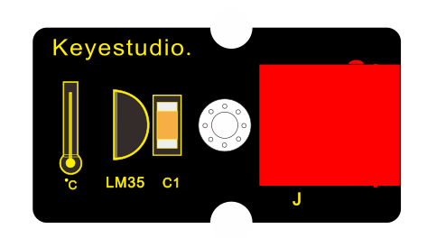 |  |  |

**3. Connect It Up**

**4.Upload the Code**

/\*

keyestudio Easy plug super kit

Project 24

Temperature meter

http://www.keyestudio.com

\*/

\#include \<TM1637Display.h\>

const int CLK = 4; //Set the CLK pin connection to the display

const int DIO = 3; //Set the DIO pin connection to the display

const uint8_t blank[] = {0x00, 0x00, 0x00,0x00};

const int tempPin = A0;

// Create degree Celsius symbol:

const uint8_t celsius[] = {

SEG_A \| SEG_B \| SEG_F \| SEG_G, // Circle

SEG_A \| SEG_D \| SEG_E \| SEG_F // C

};

// Create degree Fahrenheit symbol:

const uint8_t fahrenheit[]

= {

SEG_A \| SEG_B \| SEG_F \| SEG_G, // Circle

SEG_A \| SEG_E \| SEG_F \| SEG_G // F

};

TM1637Display display(CLK, DIO); //set up the 4-Digit Display.

void setup()

{

display.setBrightness(0x0a); //set the diplay to maximum brightness

display.setSegments(blank);//clear display

}

void loop()

{

int value = analogRead(tempPin); // read the value from sensor

float millivolts = (value / 1024.0) \* 5000;

int t = millivolts / 10; // temperature in degrees celcius

int f = (t \* 9)/5 + 32; // convert celcius to fahrenheit

// Show the temperature on the TM1637 display:

display.showNumberDec(t, false, 2, 0);

display.setSegments(celsius, 2, 2);

delay(2000);

display.showNumberDec(f, false, 2, 0);

display.setSegments(fahrenheit, 2, 2);

delay(2000);

}

//\*\*\*\*\*\*\*\*\*\*\*\*\*\*\*\*\*\*\*\*\*\*\*\*\*\*\*\*\*\*\*\*\*\*\*\*\*\*\*\*\*\*\*\*\*\*\*\*\*\*\*\*\*\*\*\*\*\*\*\*\*\*\*\*\*

**5. What You Should See**

Upload test code, you will spot the temperature value（oC）then fahrenheit
value（oF）on the digital tube

**Project 25：Thermometer**

1.  **Overview**

Temperature and humidity have the greatest impact on human health. When the
indoor temperature is too high, it will affect the temperature regulation
function of human body; when the temperature is too low, the metabolic function
and resistance of the person will reduce. The rage of the suitable relative
humidity for the human body is not more than 80%, and not less than 30%. We will
use the temperature and humidity sensor and digital tube to make a simple
temperature and humidity meter, so that we can detect the indoor temperature and
humidity data at any time.

**2.Component Required:**

| EASY plug control  board\*1                     | EASY plug DHT11   Sensor \*1                    | EASY plug 4-digit LED display \*1                | USB cable\*1                                    | RJ11 cable\*2                                                                                  |
|-------------------------------------------------|-------------------------------------------------|--------------------------------------------------|-------------------------------------------------|------------------------------------------------------------------------------------------------|
|  |  |   |  |  |

**3. Connect It Up**

**4.Upload the Code**

/\*

keyestudio Easy plug super kit

Project 25

thermometer

http://www.keyestudio.com

\*/

\#include \<dht11.h\>

\#include \<TM1637Display.h\>

\#define DHT11PIN 5 // broche DATA -\> pin 5

dht11 DHT11;

// Module connection pins (Digital Pins)

\#define CLK 4

\#define DIO 3

TM1637Display display(CLK, DIO);

// Create degree Celsius symbol:

const uint8_t celsius[] = {

SEG_A \| SEG_B \| SEG_F \| SEG_G, // Circle

SEG_A \| SEG_D \| SEG_E \| SEG_F // C

};

void setup()

{

display.setBrightness(0x0f);

}

void loop()

{

DHT11.read(DHT11PIN);

display.showNumberDec((float)DHT11.temperature,2,2);// Display Temperature in
TM1637 Display

display.setSegments(celsius, 2, 2);

delay(2000);

display.showNumberDec((float)DHT11.humidity);//Display humidity in TM1637
Display

delay(2000);

}

//\*\*\*\*\*\*\*\*\*\*\*\*\*\*\*\*\*\*\*\*\*\*\*\*\*\*\*\*\*\*\*\*\*\*\*\*\*\*\*\*\*\*\*\*\*\*\*\*\*\*\*\*\*\*\*\*

**5. What You Should See**

Upload test code, then you will see the digital tube show the temperature value
and humidity value.

**Project 26: Turn on An LED**

**1.Overview**

Dot matrix seems to be a very unfamiliar thing, but in fact it is everywhere in
our lives. It is widely used in some outdoor billboards, game consoles, and
supermarkets.

LED dot matrix has many advantages, such as power saving, long service life, low
cost, high brightness, wide viewing angle, long visual range, waterproof and so
on. It can meet different needs, so it has great development prospects.

The 8\*8 dot matrix integrated on the coding box uses I2C communication. As long
as 2 signal pins, up to 64 LEDs can be controlled, and interesting displays such
as numbers, characters, and graphics can be displayed.

The 8\*8 dot matrix uses a HT16K33 driver chip that does all the heavy lifting
for you. This chip has a built in clock so they multiplex the display. Through a
simple I2C interface, you can control the chip work and drive 8\*8 Dot matrix
screen.

Now we are about to start many 8\*8 dot matrix projects, let’s first turn on a
light on the dot matrix.

1.  **Component Required:**

| EASY plug control board\*1                      | EASY plug I2C 8x8 LED Matrix \*1                | RJ11 cable\*1                                    | USB cable\*1                                    |
|-------------------------------------------------|-------------------------------------------------|--------------------------------------------------|-------------------------------------------------|
|  |  |   |  |

-   EASY plug control board\*1

-   EASY plug I2C 8x8 LED Matrix \*1

-   EASY plug button module\*1

-   RJ11 cable\*1

-   USB cable\*1

**3.Component Introduction:**

**EASY Plug 8x8 LED Matrix**

What's better than a single LED? Lots of LEDs! A fun way to make a small display
is to use an 8x8 matrix.

This module uses HT16K33 chip to drive an 8x8 dot matrix. Just need to use the
I2C communication port of microcontroller to control the dot matrix, which can
save more port resources of microcontroller.

The four pin of this module is integrated into a crystal plug. All you need to
do is connect the module to control board for communication using an RJ11 cable.

-   Interface: Easy plug

-   Supply voltage: 4.5V-5.5V

**4.Connect It Up**

Connect the EASY Plug 8x8 LED Matrix module to control board using an RJ11
cable.

**5.Project Principle：**

The display principle of 8\*8 dot matrix is very simple. We have seen the
circuit diagram above to know that the single-chip microcomputer drives 8\*8 dot
matrix through the HT16K33 chip.

The arrangement of the dot matrix is as follows: 8 LED lights in the horizontal
direction and 8 LED lights in the vertical direction. The total number of lights
is 64. In order to quickly find the position of the light, we number the
horizontal lights from 0-7, and the vertical lights from 0-7.

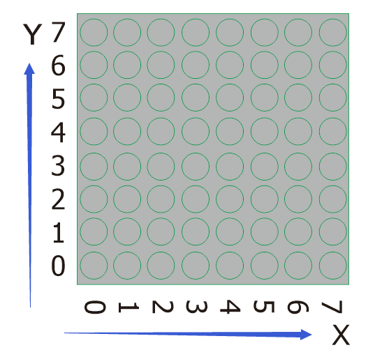

So how to light up an LED? Let’s view the following picture;

The coordinate of the point in the picture is（3,2), then we put it in the
following test code.

**6. Project code：**

/\*

keyestudio Easy plug super kit

Project 26

8\*8 dot matrix-turn on a LED

http://www.keyestudio.com

\*/

\#include \<ks_Matrix.h\>

Matrix myMatrix(A4,A5);

void setup() {

myMatrix.begin(112);

myMatrix.clear();

}

void loop() {

myMatrix.drawPixel(3,2,HIGH);

myMatrix.writeDisplay();

}

//\*\*\*\*\*\*\*\*\*\*\*\*\*\*\*\*\*\*\*\*\*\*\*\*\*\*\*\*\*\*\*\*

**7.Project results:**

Upload the code to the coding box. After success, the LED dot matrix will
display as shown in the figure below.

**Project 27: Turn On One Line**

1.  **Overview**

In previous program, we light up a coordinate point.

In this project, we will light up a row of LEDs.

**2.Component Required:**

| EASY plug control board\*1                      | EASY plug I2C 8x8 LED Matrix \*1                | RJ11 cable\*1                                    | USB cable\*1                                    |
|-------------------------------------------------|-------------------------------------------------|--------------------------------------------------|-------------------------------------------------|
|  |  |   |  |

**3.Project Principle：**

To light a row of LEDs, we need to make use of function matrix.drawLine.
Lighting up the start and terminal point on a row of LEDs indicates all LEDs on
this row are turned on, therefore, we need to decide the start and terminal
point of this row of LEDs

Seeing from the above picture, the start point locates (5,0) and the end one
is（7,5). Next, we place the value in the below code.

**4. Connect It Up**

**5.Upload the Code**

/\*

keyestudio Easy plug super kit

Project 27

8\*8 dot matrix-turn on a line

http://www.keyestudio.com

\*/

\#include \<ks_Matrix.h\>

Matrix myMatrix(A4,A5);

void setup()

{

myMatrix.begin(112);

myMatrix.clear();

}

void loop()

{

myMatrix.drawLine(0, 5, 7, 5, HIGH);

myMatrix.writeDisplay();

}

//\*\*\*\*\*\*\*\*\*\*\*\*\*\*\*\*\*\*\*\*\*\*\*\*\*\*\*\*\*\*\*\*

**6.What You Should See**

Upload the code to the coding box. After success, the LED dot matrix will
display as shown in the figure below.

**Project 28: Display A Rectangle**

1.  **Overview**

I believe that you get more interested in our programs. In this part, we will
display a rectangle on 8\*8 dot matrix.

**2.Component Required:**

| EASY plug control board\*1                      | EASY plug I2C 8x8 LED Matrix \*1                | RJ11 cable\*1                                    | USB cable\*1                                    |
|-------------------------------------------------|-------------------------------------------------|--------------------------------------------------|-------------------------------------------------|
|  |  |   |  |

**3.Project Principle：**

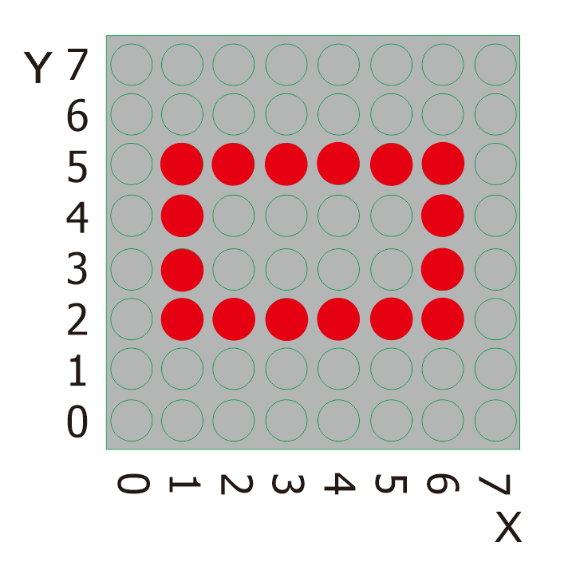

So, how to show a rectangle? We need use a function matrix.fillRect, which
implies that you have to make sure a point on dot matrix so as to draw a square
or rectangle, as shown below:

For example, we will draw a rectangle 4 in width and length in 6 from the
point（2.2). What we need to do is put the value of width and length behind the
point（1.2). Therefore, we get the code（1, 2, 6, 4).

If display a square with 4 in width and length, its code are supposed to be
(1，2，4,4）.

**4.Connect It Up**

**5. Upload the Code**

/\*

keyestudio Easy plug super kit

Project 28

8\*8 dot matrix-turn on a rectangle

http://www.keyestudio.com

\*/

\#include \<ks_Matrix.h\>

Matrix myMatrix(A4,A5);

void setup()

{

myMatrix.begin(112);

myMatrix.clear();

}

void loop()

{

myMatrix.drawRect(1,2,6,4,HIGH);

myMatrix.writeDisplay();

}

//\*\*\*\*\*\*\*\*\*\*\*\*\*\*\*\*\*\*\*\*\*\*\*\*\*\*\*\*\*\*\*\*

**6.What You Should See**

Upload the code to the coding box. After success, the LED dot matrix will
display as shown in the figure below.

**Project 29: Display A Circle**

1.  **Overview**

In this program, we will generate a circle on 8\*16 dot matrix.

**2.Component Required:**

| EASY plug control board\*1                      | EASY plug I2C 8x8 LED Matrix \*1                | RJ11 cable\*1                                    | USB cable\*1                                    |
|-------------------------------------------------|-------------------------------------------------|--------------------------------------------------|-------------------------------------------------|
|  |  |   |  |

**3.Project Principle：**

To show a circle with a radius of 2, we can use a function matrix.drawCircle.
Select a central point to decide its coordinate and check radius value, as shown
below:

The coordinate of center point of circle is（3,4), its radius is 2. We could put
value（3,4, 2, ）in the following code. If we want to draw a circle with a
constant center point and a radius of 2, we just need to change the value behind
coordinate of center point into 3.

**4.Connect It Up**

**5. Upload the Code**

/\*

keyestudio Easy plug super kit

Project 29

8\*8 dot matrix-turn on a circle

http://www.keyestudio.com

\*/

\#include \<ks_Matrix.h\>

Matrix myMatrix(A4,A5);

void setup()

{

myMatrix.begin(112);

myMatrix.clear();

}

void loop()

{

myMatrix.drawCircle(3,4,2,HIGH);

myMatrix.writeDisplay();

}

//\*\*\*\*\*\*\*\*\*\*\*\*\*\*\*\*\*\*\*\*\*\*\*\*\*\*\*\*\*\*\*\*

**6.What You Should See**

Upload the code to the coding box. After success, the LED dot matrix will
display as shown in the figure below.

**Project 30: Display Text and Numbers**

1.  **Overview**

In this project, we will make 8\*8 dot matrix to produce some numbers and texts,
like advertisement board at bus station.

**2.Component Required:**

| EASY plug control board\*1                      | EASY plug I2C 8x8 LED Matrix \*1                | RJ11 cable\*1                                    | USB cable\*1                                    |
|-------------------------------------------------|-------------------------------------------------|--------------------------------------------------|-------------------------------------------------|
|  |  |   |  |

**3.Project Principle：**

This program is pretty easy. We only need to confirm the coordinate of texts and
numbers. Let’s conduct an experiment to illustrate.

We set the display area(“OK”) to start from number 2 on horizontal coordinate
and number zero on vertical coordinate, as shown below

We add the texts to be shown in the code matrix.print after getting the
coordinate of text. Note: numbers can be shown directly, but texts need adding
double quotes.

**4. Connect It Up**

**5.Upload the Code**

/\*

keyestudio Easy plug super kit

Project 30

8\*8 dot matrix-display text and numbers

http://www.keyestudio.com

\*/

\#include \<ks_Matrix.h\>

Matrix myMatrix(A4,A5);

void setup() {

myMatrix.begin(112);

myMatrix.clear();

}

void loop() {

myMatrix.setTextSize(1);//Set font size

myMatrix.setTextWrap(false); // we don’t want text to wrap so it scrolls nicely

myMatrix.setTextColor(1);

myMatrix.setRotation(0);// show rotation

myMatrix.clear();

myMatrix.setCursor(2,0);//set the coordinate of text

myMatrix.print("K"); //show K

myMatrix.writeDisplay();

delay(1000);

}

//\*\*\*\*\*\*\*\*\*\*\*\*\*\*\*\*\*\*\*\*\*\*\*\*\*\*\*\*\*\*\*\*

**6.What You Should See**

Upload the code to the coding box. After success, the LED dot matrix will
display as shown in the figure below.

**Project 31: Display Images**

1.  **Overview**

A large number of display devices, like cellphone, computer screen and
advertisement board, are made of tiny light-emitting unit. The 8\*8 dot matrix
aren’t able to show exquisite and high pixel pictures but some cute and
customized heart-shape picture, smiley face and so on, even though consisting of
64 pcs light-emitting units.

**2.Component Required:**

| EASY plug control board\*1                      | EASY plug I2C 8x8 LED Matrix \*1                | RJ11 cable\*1                                    | USB cable\*1                                    |
|-------------------------------------------------|-------------------------------------------------|--------------------------------------------------|-------------------------------------------------|
|  |  |   |  |

**3.Project Principle：**

The online version of dot matrix modulus tool:

[http://dotmatrixtool.com/\#](http://dotmatrixtool.com/)

The dot matrix is 8\*8 in this project, thereby, set the height to 8, width to
8, as shown below.

As same as dot matrix on Max board

Click Byte order to select“Row Major”

Tap endian to set little endian(lsb)

Then we draw the pattern we need.

Click generate to get hexadecimal code.

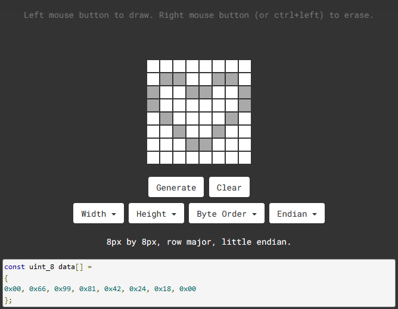

0x00, 0x66, 0x99, 0x81, 0x42, 0x24, 0x18, 0x00

Move the above hexadecimal code into the code of the below program.

**4.Connect It Up**

**5.Upload the Code**

/\*

keyestudio Easy plug super kit

Project 31

8\*8 dot matrix-display images

http://www.keyestudio.com

\*/

\#include \<ks_Matrix.h\>

Matrix myMatrix(A4,A5);

uint8_t LedArray1[8]={0x00, 0x66, 0x99, 0x81, 0x42, 0x24, 0x18, 0x00};

uint8_t LEDArray[8];

void setup(){

myMatrix.begin(0x70);

}

void loop(){

myMatrix.clear();

for(int i=0; i\<8; i++)

{

LEDArray[i]=LedArray1[7-i];

for(int j=7; j\>=0; j--)

{

if((LEDArray[i]&0x01)\>0)

myMatrix.drawPixel(j, i,1);

LEDArray[i] = LEDArray[i]\>\>1;

}

}

myMatrix.writeDisplay();

}

//\*\*\*\*\*\*\*\*\*\*\*\*\*\*\*\*\*\*\*\*\*\*\*\*\*\*\*\*\*\*\*\*

**6.What You Should See**

Upload the code to the coding box. After success, the LED dot matrix will
display as shown in the figure below.

**Project 32: Digital Sensor and 8\*8 Dot Matrix**

1.  **Overview**

In the previous project, we have finished the experiments to control the light
by button switches and limit switches. Here we are going to combine buttons
switches, limit switches and a 8\*8 dot matrix to make an interactive display
project.

1.  **Component Required:**

| EASY plug control board\*1                      | EASY plug Crash Sensor \*1                      | EASY plug Digital Push Button                   | EASY plug I2C 8x8 LED Matrix \*1                | RJ11 cable\*3                                                                                                                                 | USB cable\*1                                    |
|-------------------------------------------------|-------------------------------------------------|-------------------------------------------------|-------------------------------------------------|-----------------------------------------------------------------------------------------------------------------------------------------------|-------------------------------------------------|
|  |  |  |  |  |  |

**3.Project Principle：**

The pins of two buttons are connected to D8 and D9 and we know how to display
test on 8\*8 dot matrix. Therefore, we will make 8\*8 dot matrix show“L”and
“R”by pressing the button and the limit switch

**4. Connect It Up**

**5. Upload the Code**

/\*

keyestudio Easy plug super kit

Project 32

8\*8 dot matrix-digital control

http://www.keyestudio.com

\*/

\#include \<ks_Matrix.h\>

Matrix myMatrix(A4,A5);

int K1=8;

int K2=9;

int x;

void setup()

{

myMatrix.begin(112);

myMatrix.clear();

pinMode(K1,INPUT);

pinMode(K2,INPUT);

myMatrix.drawCircle(3,3, 2, 1);

myMatrix.writeDisplay(); // write the changes we just made to the display

}

void loop()

{

int K1_level=digitalRead(K1);

int K2_level=digitalRead(K2);

if(K1_level==0)

{

myMatrix.setTextSize(1);

myMatrix.setTextWrap(false); // we dont want text to wrap so it scrolls nicely

myMatrix.setTextColor(1);

myMatrix.setRotation(0);

myMatrix.clear();

myMatrix.setCursor(2,0);

myMatrix.print("L");

myMatrix.writeDisplay();

}

if(K2_level==0)

{

myMatrix.setTextSize(1);

myMatrix.setTextWrap(false); // we dont want text to wrap so it scrolls nicely

myMatrix.setTextColor(1);

myMatrix.setRotation(0);

myMatrix.clear();

myMatrix.setCursor(2,0);

myMatrix.print("R");

myMatrix.writeDisplay();

}}

//\*\*\*\*\*\*\*\*\*\*\*\*\*\*\*\*\*\*\*\*\*\*\*\*\*\*\*\*\*\*\*\*

**6.What You Should See**

Upload the code to the coding box, after success,The LED dot matrix first
displays a circle,Press the left button and the LED dot matrix displays the
letter "L",Press the right button and the LED dot matrix displays the letter
"R".

**Project 33: Pressure Sensor and 8\*8 Dot Matrix**

1.  **Overview**

We read the analog value of the thin film pressure sensor in the previous
project. Then we use the pressure sensor and 8\*8 dot matrix to make an
interactive project. When we press the sensor, the longer the light beam is
displayed on the dot matrix.

| EASY plug control board\*1                      | EASY plug pressure sensor Sensor \*1            | EASY plug I2C 8x8 LED Matrix \*1                | RJ11 cable\*2                                                                                  | USB cable\*1                                    |
|-------------------------------------------------|-------------------------------------------------|-------------------------------------------------|------------------------------------------------------------------------------------------------|-------------------------------------------------|
|  |  |  |  |  |

1.  **Component Required:**

**3.Project Principle：**

The signal pin of light sensor is linked with A0 of MAX development board. 8\*16
dot matrix will show the height of light column, the larger the pressure is, the
higher the height of light column.

**4. Connect It Up**

**5.Upload the Code**

/\*

keyestudio Easy plug super kit

Project 33

8\*8 dot matrix-Film pressure control

http://www.keyestudio.com

\*/

\#include \<ks_Matrix.h\>

Matrix myMatrix(A4,A5);

int pressure = A0;

int pressure_val;

void setup() {

pinMode(A0,INPUT);

myMatrix.begin(112);

myMatrix.clear();

}

void loop() {

pressure_val=analogRead(A0);

pressure_val=map(pressure_val,0,1023,0,15);

myMatrix.clear();

myMatrix.drawLine(3,0, 3,pressure_val, 1);

myMatrix.writeDisplay(); // write the changes we just made to the display

delay(10);

}

//\*\*\*\*\*\*\*\*\*\*\*\*\*\*\*\*\*\*\*\*\*\*\*\*\*\*\*\*\*\*\*\*

**6. What You Should See**

Upload test code, the length of a column of LEDs will vary with the pressure
value detected by the pressure sensor.

**Project 34: Microphone Sensor and 8\*8 Dot Matrix**

1.  **Overview**

In this lesson, we will create more fantastic programs with microphone sensor
and 8\*8 dot matrix.

1.  **Component Required:**

| EASY plug control board\*1                      | EASY plug Sound Sensor \*1                      | EASY plug I2C 8x8 LED Matrix \*1                | RJ11 cable\*2                                                                                  | USB cable\*1                                    |
|-------------------------------------------------|-------------------------------------------------|-------------------------------------------------|------------------------------------------------------------------------------------------------|-------------------------------------------------|
|  |  |  |  |  |

**3.Project Principle：**

The circle on dot matrix will enlarge with the sound intensity. The stronger the
sound intensity, the larger the circle gets.

**4. Connect It Up**

**5.Upload the Code**

/\*

keyestudio Easy plug super kit

Project 34

8\*8 dot matrix-sound control

http://www.keyestudio.com

\*/

\#include \<ks_Matrix.h\>

Matrix myMatrix(A4,A5);

int mic = A0;

int Mic_val;

void setup() {

pinMode(mic,INPUT);

myMatrix.begin(112);

myMatrix.clear();

}

void loop() {

Mic_val=analogRead(mic);

Mic_val=map(Mic_val,0,1023,0,10);

myMatrix.clear();

myMatrix.drawCircle(3,3,Mic_val, 1);

myMatrix.writeDisplay(); // write the changes we just made to the display

delay(10);

}

//\*\*\*\*\*\*\*\*\*\*\*\*\*\*\*\*\*\*\*\*\*\*\*\*\*\*\*\*\*\*\*\*

**6.What You Should See**

Upload the code to the coding box, after success, the LED dot matrix displays a
dot,When the sound sensor detects sound,

The LED dot matrix displays a circle with a point as the center. The louder the
sound, the larger the circle.

****

## Project 35: LCD 1602 Display

**1.Overview**

In this project, you will learn how to use an LCD module. An LCD, or liquid
crystal display, is a simple screen that can display commands, bits of
information, or readings from your sensor - all depending on how you program
your board.

1.  **Component Required:**

| EASY plug control board\*1                      | EASY plug 1602 LCD Module \*1                   | RJ11 cable\*1                                    | USB cable\*1                                    |
|-------------------------------------------------|-------------------------------------------------|--------------------------------------------------|-------------------------------------------------|
|  |  |   |  |

**3.Component Introduction:**

**EASY plug 1602 LCD Module**

This is a basic 16 character by 2 line LCD display with white text on blue
background.

It comes with EASY Plug connector, you can use one line for simple connection.

-   Compatible with [Arduino LiquidCrystal
    Library](http://arduino.cc/en/Reference/LiquidCrystal)

-   White text on blue background

-   16 characters wide, 2 rows

-   I2C Address: 0x27

-   Back Light: Blue

-   Text Color: White

-   Supply Voltage: 5V

-   Adjusting contrast by a potentiometer

**4.Connect It Up**

Connect the EASY Plug 1602 LCD module to control board using an RJ11 cable.

**5. Upload the Code**

/\*

keyestudio Easy plug super kit

Project 35

LCD 1602

http://www.keyestudio.com

\*/

\#include \<Wire.h\>

\#include \<LiquidCrystal_I2C.h\>

LiquidCrystal_I2C lcd(0x27,16,2); // set the LCD address to 0x27 for a 16 chars
and 2 line display

void setup()

{

lcd.init(); // initialize the lcd

lcd.init();

// Print a message to the LCD.

lcd.backlight();

}

void loop()

{

lcd.setCursor(2,0);

lcd.print("Hello, world!");

lcd.setCursor(2,1);

lcd.print("keyestudio!");

}

//\*\*\*\*\*\*\*\*\*\*\*\*\*\*\*\*\*\*\*\*\*\*\*\*\*\*\*\*\*\*\*\*\*\*\*\*\*\*\*\*\*\*\*\*\*\*\*\*\*\*\*\*\*\*\*\*\*\*\*\*\*\*\*\*\*\*\*\*\*\*\*

**6.What You Should See**

Initially, you should see the words “hello, word!” and “keyestudio!” pop up on
your LCD.

Remember you can adjust the contrast using the potentiometer on the module back
if you can’t make out the words clearly.

**Little Knowledge:**

-   If you want to change the characters showed on the LCD screen, you can
    modify it in the code shown below.

-   Remember you can adjust the contrast by rotating a blue potentiometer on the
    LCD back if you can’t make out the words clearly.

## Project 36: Intruder Alarm System

1.  **Overview**

The intruder alarm system will be activated and output signals when hazards
happen. If detecting the illegal intrusion, it will call the police. In this
project we can make an intruder alarm with a line tracking sensor and an LCD1602
display. When the sensor detects the illegal intrusion, the LED will flash and
LCD 1602 display will show the data.

**2.Component Required:**

| EASY plug control board\*1                      | EASY plug 1602 LCD Module \*1                   | RJ11 cable\*1                                    | USB cable\*1                                    |
|-------------------------------------------------|-------------------------------------------------|--------------------------------------------------|-------------------------------------------------|
|  |  |   |  |
| EASY plug LED Module \*1                        | EASY plug Line Tracking Sensor \*1              |                                                  |                                                 |
| 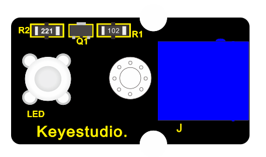 |  |                                                  |                                                 |

**3.Connect It Up**

**4.Upload the Code**

/\*

keyestudio Easy plug super kit

Project 36

Intrusion alarm

http://www.keyestudio.com

\*/

\#include \<Wire.h\>

\#include \<LiquidCrystal_I2C.h\>

LiquidCrystal_I2C lcd(0x27,16,2);

byte sensorPin = 9;

byte indicator = 5;

void setup()

{

lcd.init(); // initialize the lcd

lcd.init();

// Print a message to the LCD.

lcd.backlight();

pinMode(sensorPin,INPUT);

pinMode(indicator,OUTPUT);

Serial.begin(9600);

}

void loop()

{

byte state = digitalRead(sensorPin);

if(state == 0)

{

lcd.setCursor(2,0);

lcd.print("Somebody is");

lcd.setCursor(2,1);

lcd.print("in this area!");

digitalWrite(indicator,HIGH);

delay(100);

digitalWrite(indicator,LOW);

delay(100);

}

else if(state == 1)

{

lcd.setCursor(2,0);

lcd.print("No one!");

lcd.print(" ");

lcd.setCursor(2,1);

lcd.print("No one!");

lcd.print(" ");

delay(500);

}

}

//\*\*\*\*\*\*\*\*\*\*\*\*\*\*\*\*\*\*\*\*\*\*\*\*\*\*\*\*\*\*\*\*\*\*\*

**5. What You Should See**

After uploading the code, when something other than black is sensed, the LCD1602
display will display "Somebody is" and "in this area!", and the LED will flash;
if no object is detected, the LCD1602 display will show "No one!" ", the LED
won’t flash.

## Project 37: Decibel tester

1.  **Overview**

Noise pollution is one of the environmental pollution that have a greater
impact. Higher decibel noise can even lead to serious damage to the eardrum of a
person, Noise tester is an instrument used for noise detection and testing in
public places such as workplace and squares. In this project, we will use the
combination of sound sensor and LCD1602 display to make a simulated noise
tester. We also connect an LED to display the sound intensity. If the sound is
loud, the LED will be bright, and if no sound, the LED will be off.

1.  **Component Required:**

| EASY plug control board\*1                      | EASY plug 1602 LCD Module \*1                   | RJ11 cable\*1                                    | USB cable\*1                                    |
|-------------------------------------------------|-------------------------------------------------|--------------------------------------------------|-------------------------------------------------|
|  |  |   |  |
| EASY plug LED Module \*1                        | EASY plug Sound Sensor \*1                      |                                                  |                                                 |
|  |  |                                                  |                                                 |

1.  **Connect It Up**

**4.Upload the Code**

/\*

keyestudio Easy plug super kit

Project 37

Decibel tester

http://www.keyestudio.com

\*/

\#include \<Wire.h\>

\#include \<LiquidCrystal_I2C.h\>

LiquidCrystal_I2C lcd(0x27,16,2);

int ledpin=5;// initialize digital pin 5, output regulating the brightness of
LED

int val=0;// initialize variable va

int sensorValue=0;

void setup() {

pinMode(ledpin,OUTPUT);// set digital pin 11 as “output”

lcd.init(); // initialize the lcd

lcd.init();

// Print a message to the LCD.

lcd.backlight();

}

// the loop routine runs over and over again forever:

void loop()

{

val= map(analogRead(A0),0,1023,0,255);

analogWrite(ledpin,val);// turn on the LED and set up brightness（maximum output
value 255）

delay(10);// wait for 0.01

sensorValue=analogRead(A0);// read the input on analog pin 0:

lcd.setCursor(1,0);

lcd.print("SensorValue : ");

lcd.setCursor(3,1);

lcd.print(sensorValue);// print out the value you read:

delay(1000);

lcd.clear();

delay(1); // delay in between reads for stability

}

/////////////////////////////////////////////////////////////////////

**5. What You Should See**

Upload the test code, LCD1602 display shows the analog value detected by the
sound sensor and LED’s brightness is proportion to the analog value of the sound
sensor.

## Project 38: LCD Thermometer

1.  **Overview**

Digital thermometer and hygrometer are very common things in our daily life.

In this project, we combine the DHT11 temperature and humidity sensor with the
1602 liquid crystal display to make a digital thermometer and hygrometer.

**2.Component Required:**

| EASY plug control board\*1                      | EASY plug 1602 LCD Module \*1                   | EASY plug DHT11 Sensor \*1                       | USB cable\*1                                    | RJ11 cable\*1                                                                                                                                 |
|-------------------------------------------------|-------------------------------------------------|--------------------------------------------------|-------------------------------------------------|-----------------------------------------------------------------------------------------------------------------------------------------------|
|  |  |   |  |  |

**3. Connect It Up**

**4.Upload the Code**

/\*

keyestudio Easy plug super kit

Project 38

LCD Thermometer

http://www.keyestudio.com

\*/

\#include \<dht11.h\>

dht11 DHT;

\#define DHT11_PIN 5

\#include \<Wire.h\>

\#include \<LiquidCrystal_I2C.h\>

LiquidCrystal_I2C lcd(0x27,16,2); // set the LCD address to 0x27 for a 16 chars
and 2 line display

void setup()

{

Serial.begin(9600);

lcd.init(); // initialize the lcd

lcd.init();

// Print a message to the LCD.

lcd.backlight();

}

void loop()

{

int chk;

chk = DHT.read(DHT11_PIN); //Read data temperature from DHT11 pin

lcd.setCursor(0,0);

lcd.print("Temperature=");

lcd.println(DHT.temperature);

lcd.setCursor(1,1);

lcd.print("Humidity=");

lcd.println(DHT.humidity);

delay(1000);

}

//\*\*\*\*\*\*\*\*\*\*\*\*\*\*\*\*\*\*\*\*\*\*\*\*\*\*\*\*\*\*\*\*

**5.What You Should See**

Upload test code, LCD1602 display will show the ambient temperature and humidity
value.

# 6. Resources

-   Keyestudio Official Website: <http://www.keyestudio.com/>

-   Keyestudio WIKI Website: <http://wiki.keyestudio.com/>

-   User Guide Download:

-   Arduino Software:

https://www.arduino.cc/en/Main/OldSoftwareReleases

# 

# Our Tutorial

From the tutorial, you will learn all the basic information about EASY Plug
controller board, sensor module, very easy to play and and to make interactive
projects. Enjoy your time!

Well, it's just the beginning of programming journey. There are more and more
awesome projects for you to explore.

Furthermore, our KEYESTUDIO research and development team will continue to
explore on this path, walking you through the basics up to complex projects.

Hope that you can enjoy our works!

# About keyestudio

Located in Shenzhen, the Silicon Valley of China, KEYES DIY ROBOT CO.,LTD is a
thriving technology company dedicated to open-source hardware research &
development, production and marketing.

Keyestudio is a best-selling brand owned by KEYES Corporation, our product lines
range from Arduino boards, shields, sensor modules, Raspberry Pi, micro:bit
extension boards and smart car to complete starter kits designed for customers
of any level to learn programming knowledge.

All of our products comply with international quality standards and are greatly
appreciated in a variety of different markets throughout the world.

For more details of our products, you can check it from the links below.

Official website: <http://www.keyestudio.com/>

US Amazon storefront: <http://www.amazon.com/shops/A26TCVWBQE4D9T>

CA Amazon storefront: <http://www.amazon.ca/shops/A26TCVWBQE4D9T>

UK Amazon storefront:<http://www.amazon.co.uk/shops/A39F7KX4U3W9JH>

DE Amazon storefront: <http://www.amazon.de/shops/A39F7KX4U3W9JH>

FR Amazon storefront: <http://www.amazon.de/shops/A39F7KX4U3W9JH>

ES Amazon storefront: <http://www.amazon.de/shops/A39F7KX4U3W9JH>

IT Amazon storefront: <http://www.amazon.de/shops/A39F7KX4U3W9JH>

US Amazon storefront: <http://www.amazon.com/shops/APU90DTITU5DG>

CA Amazon storefront: <http://www.amazon.ca/shops/APU90DTITU5DG>

JP Amazon storefront: <http://www.amazon.jp/shops/AE9VWCCXQIC6J>

# Customer Service

As a continuous and fast growing technology company, we keep striving our best
to offer you excellent products and quality service as to meet your expectation.

We look forward to hearing from you and any of your critical comment or
suggestion would be much valuable to us.

You can reach out to us by simply drop a line at **keyestudio@126.com**

Thank you in advance.

